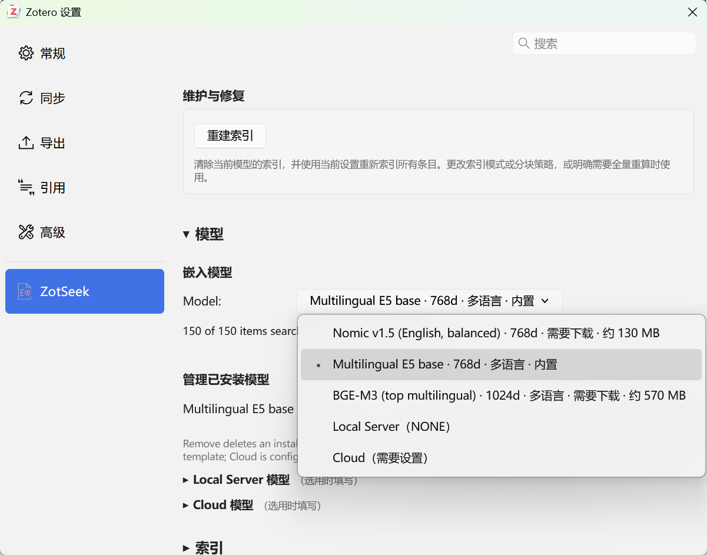
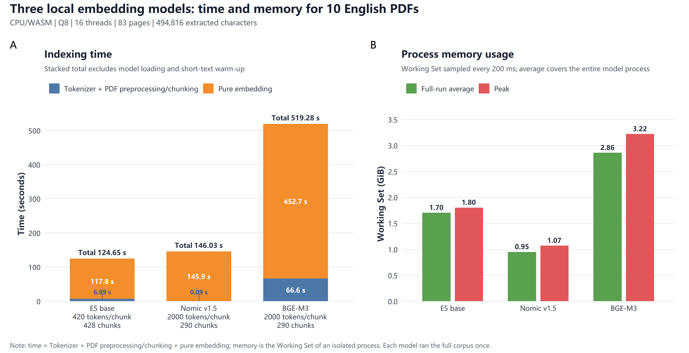
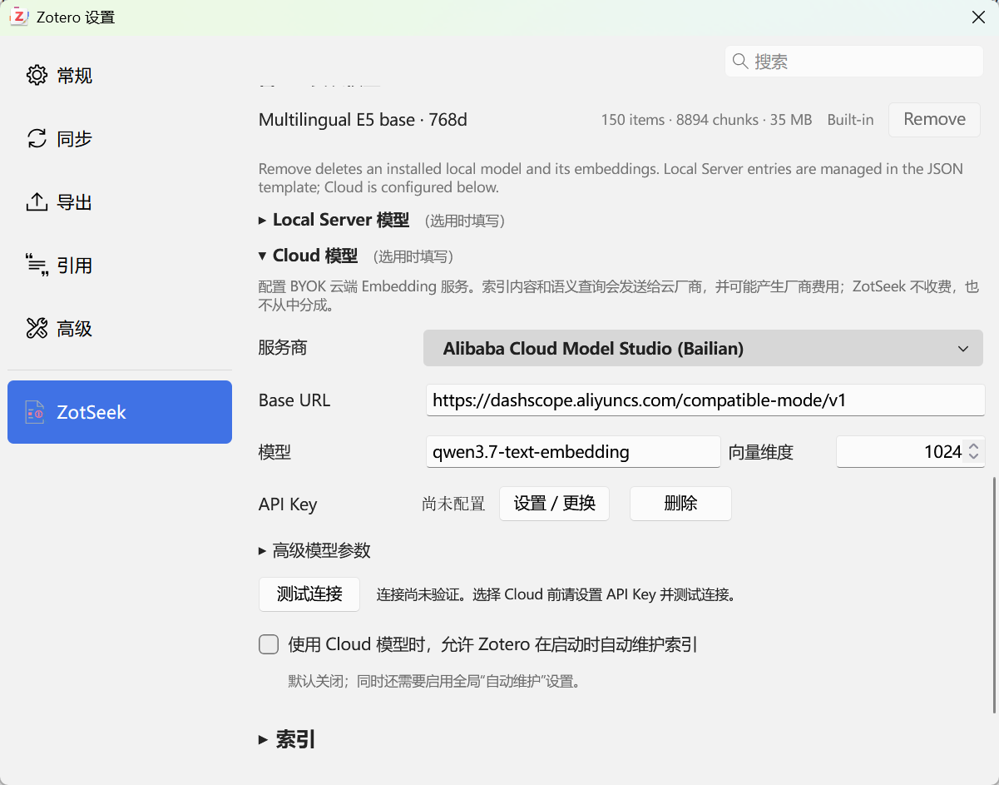
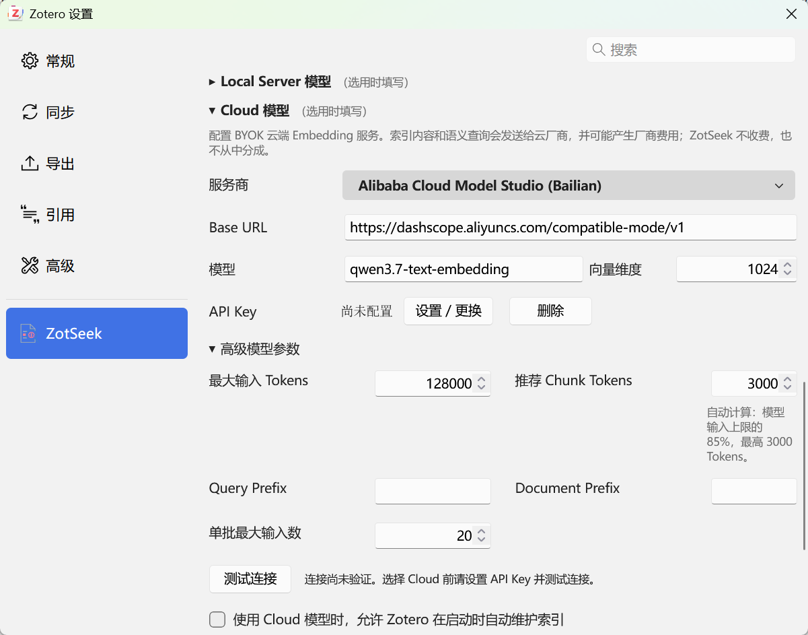
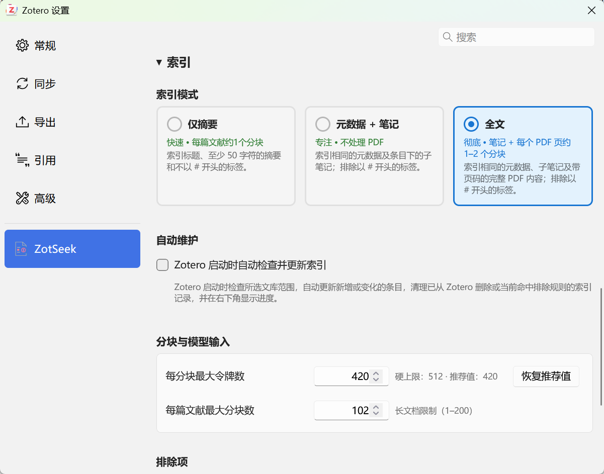
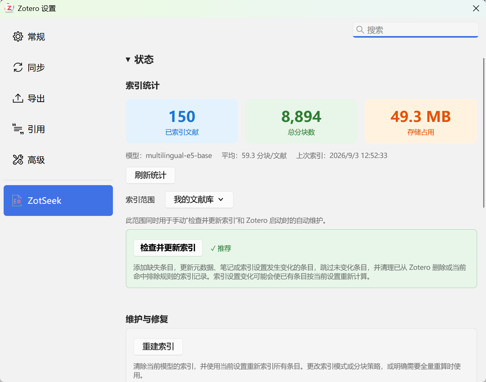
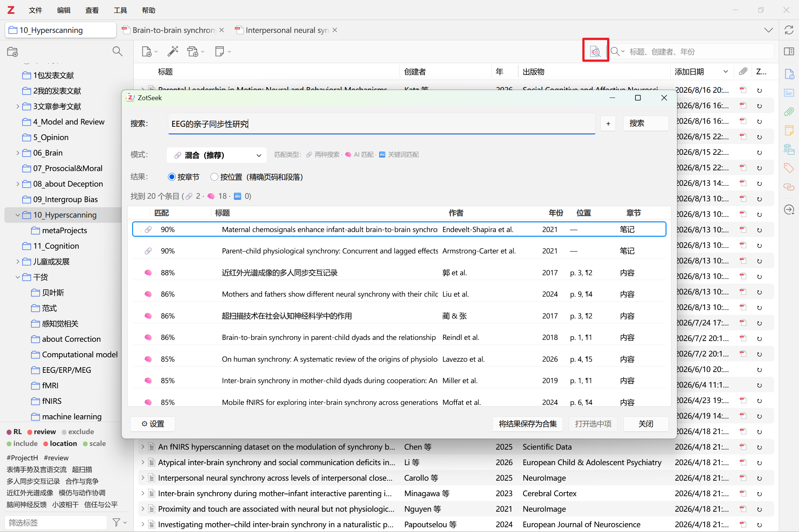
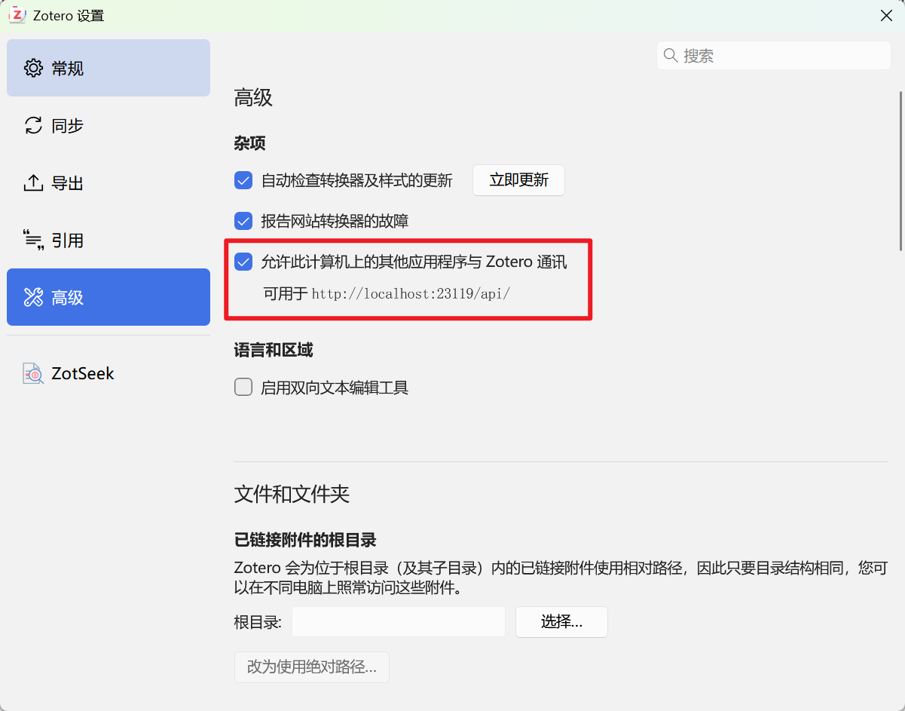
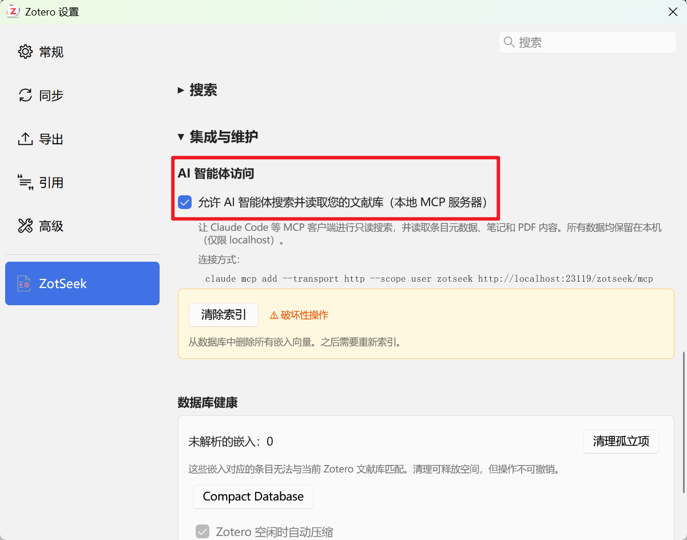
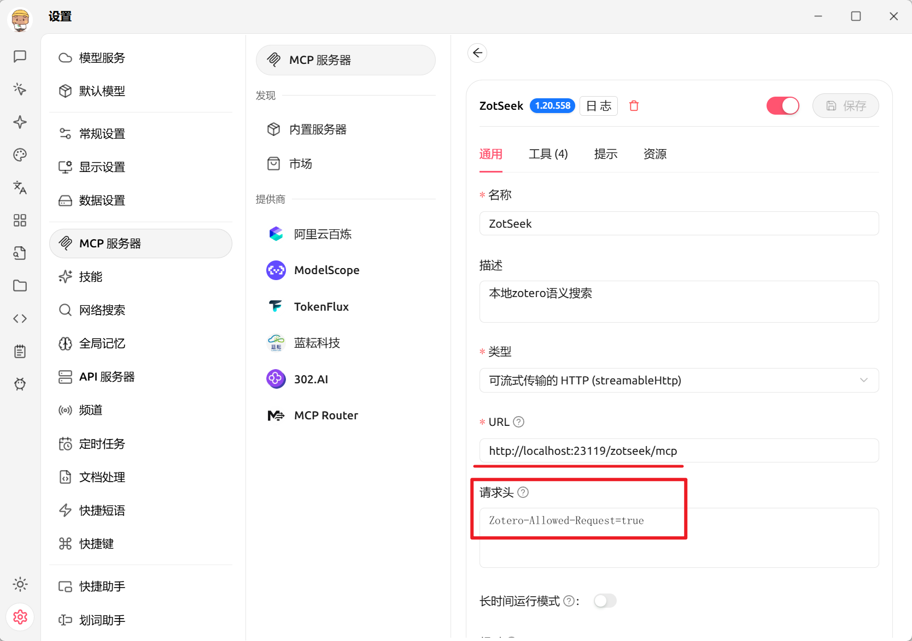

# ZotSeek-U

> **Universal, multilingual, and evidence-grounded retrieval for Zotero.**

[English](README.md) | **简体中文**

## 安装与版本迁移

> **重要：ZotSeek-U 是 ZotSeek 的替代安装，不能与原版同时安装或同时使用。** 两者保留相同的 Zotero 插件 ID 和本地数据命名空间，因此安装 ZotSeek-U 会替换现有的 ZotSeek。

ZotSeek-U 将从 `0.1.0` 重新开始独立版本编号。由于它低于继承自原项目的开发版本 `1.20.558`，Zotero 不会向现有安装自动推送 `0.1.0`，手动安装时也可能将其提示为降级安装。

如果希望保留现有索引和设置，请下载 ZotSeek-U XPI，并在 Zotero 的插件管理器中将它**直接覆盖安装到现有 ZotSeek 上**。不要先卸载 ZotSeek：真正卸载会执行清理，删除 `zotseek.sqlite` 和 `extensions.zotero.zotseek.*` 偏好。手动降级只在这次版本体系切换时需要；安装 `0.1.0` 后，后续 `0.1.1` 等 ZotSeek-U 版本即可正常自动更新。

## 项目宗旨

> **让 Zotero 成为文献管理 AI 时代的基础设施。**

ZotSeek-U 是 [ZotSeek](https://github.com/introfini/ZotSeek) 的一个独立 fork，目标是在 Zotero 中实现面向本地文献库的多语言语义搜索，并让检索结果能够通过元数据、Notes、原文片段和 PDF 页码得到验证。

## 为什么维护这个 fork

我们每个人或许都有找不到某篇文献的时候：明明记得其中讨论过一个概念或细节，却想不起标题和关键词，查找起来非常费劲。基于向量检索的 Semantic Search 是解决这个问题非常棒的方式。自 2024 年以来，我一直期待能够像向 Consensus 提问一样，检索自己保存在 Zotero 中的本地文献。

我尝试过 Zotero-MCP，但它需要额外运行一个占用不低的 Python 进程，并且主要通过 MCP 调用；其他 Zotero 语义搜索插件的表现也不太符合我的预期。ZotSeek 是我在这个方向上见过最棒的插件，它几乎满足了我对“在 Zotero 中通过语义搜索寻找文献”的所有想象。

不过，原版 ZotSeek 与我的实际使用习惯仍有一些差别：

1. 部分分块逻辑依赖固定规则估算 token。它处理英文时高效可靠，但可能低估中文等语言的实际 token 数量；对于 E5 这类上下文较小的模型，超出限制的内容会被 tokenizer 截断，从而造成 chunk 尾部丢失。

2. Zotero 文献库是一个长期积累的过程，许多科研人员保存了大量有价值的 Notes。原有索引没有充分利用这些内容，而 PDF 全文索引的计算量又可能比 Metadata 索引高出几个数量级，因此我希望提供一个兼顾成本与内容覆盖的模式。

3. 原项目强调隐私和本地运行，没有提供用户自带 API Key 使用 Cloud Embedding 的途径。我认为不少用户愿意尝试这一选择；有隐私顾虑的用户则可以继续完全使用本地功能。

4. 原有 Hybrid Search 通过 Semantic Search 与 Zotero 搜索的启发式结果进行 RRF 融合，实测召回表现不错，但仍有进一步提高的空间。

基于这些原因，我建立并持续维护这个 fork，主要增加：

- 面向中文、日语、韩语、泰语和俄语等语言的可靠支持，并在可用时使用模型自带 tokenizer 计算 tokens；
- `Metadata + Notes` 混合索引模式，以及重新设计的混合搜索模式；
- 用户自带 API Key 的可选 Cloud Embedding；
- 基于 Semantic Search + BM25 的 Hybrid Search 逻辑。

围绕分块、Embedding 和检索质量进行的实验较多，相关过程和结果会陆续发布在项目 Blog 中。

## 主要目标

1. 支持中文和多语言文献的语义检索。

2. 探索标题、摘要、标签、PDF 全文和 Child Notes 的统一索引方式。

3. 研究文本预处理、结构化分块和 Embedding 输入方式对检索效果的影响。

4. 改进 Embedding、语义搜索、混合检索和 MCP 调用等环节，为外部 AI Agent 提供可验证的文献检索结果。

## 使用

初次使用时，软件内置了 Embedding 模型，默认索引模式为“元数据 + 笔记”。嵌入模型默认为 Multilingual E5 base，该模型支持多语言，处理速度合理，唯一的缺点是上下文只有 512 tokens。执行“检查并更新索引”后，即可使用 Hybrid Search 开始检索。

### 1. 选择 Embedding 模型

在 **Zotero 设置 → ZotSeek → 模型** 中选择 Embedding 方式：

- **Multilingual E5 base**：内置的默认多语言模型，安装后即可使用；
- **Nomic v1.5**：偏向英文语料，需要另行下载；
- **BGE-M3**：更大的多语言模型，需要另行下载；
- **Local Server**：使用 LM Studio、Ollama、llama.cpp 或 vLLM 等本地推理服务；
- **Cloud**：使用用户自己的 API Key 调用云端 Embedding 服务。



#### 模型选择参考：性能 benchmark

下图可作为选择 Embedding 模型时的性能参考。测试在 **AMD Ryzen 7 4800H（R7 4800H）**、16 个逻辑线程的电脑上进行，使用 CPU/WASM Q8 推理，并对同一组 10 篇英文 PDF（83 页、494,816 个抽取字符）完整运行一次。图中比较索引计算耗时和进程 Working Set；实际结果会受硬件、文库规模、PDF 长度和后台负载影响，不能视为所有设备的保证值。本 benchmark 未测试检索质量。



大多数用户可以直接使用内置模型。选择新的模型后，需要为该模型建立自己的索引；不同模型的 Embeddings 会分开保存，不会混合比较。

#### 可选：Cloud Embedding

Cloud Embedding 为可选功能。索引内容和语义查询会发送给云厂商，并可能产生厂商费用；ZotSeek-U 不收费，也不参与分成。有隐私顾虑的用户可以不使用这项功能。

设置 API Key 后，先测试连接，再选择 Cloud 模型。API Key 通过 Zotero 的安全凭据存储，不写入普通偏好或项目文件。



高级参数用于填写模型上下文、维度、前缀和批量大小。除非清楚云端模型的实际接口契约，否则建议保留预设值。



### 2. 选择索引模式

在 **Zotero 设置 → ZotSeek → 索引** 中选择需要进入 Embedding 的内容：

- **仅摘要**：主要索引 Metadata，速度最快、占用最小；
- **元数据 + 笔记**：加入文献下的 Child Notes，不处理 PDF，推荐作为日常模式；
- **全文**：在 Metadata 和 Notes 之外加入 PDF 正文，覆盖最完整，但耗时和空间占用也最高。

索引模式决定哪些内容进入索引；它与搜索时选择的 Hybrid、Semantic 或 Keyword 模式不是一回事。



### 3. 建立和维护索引

选择模型和索引模式后，在 **状态** 中确认索引范围，然后点击 **检查并更新索引**。它会添加缺失条目、更新发生变化的 Metadata、Notes 和索引配置，并跳过没有变化的条目。



“检查并更新索引”适合日常使用。只有在插件明确提示、索引策略发生重大变化或需要从头开始时，才使用“重建索引”。使用 Cloud 模型进行更新或重建可能产生费用。

### 4. 搜索文献

点击 Zotero 工具栏中的 ZotSeek 图标打开搜索窗口，输入自然语言问题并选择搜索模式：

- **Hybrid Search**：融合 Semantic Search 与 BM25，默认推荐；
- **Semantic Search**：适合概念、含义以及不同措辞之间的匹配；
- **Keyword Search**：适合标题、术语、缩写等准确词语。

结果可以按文献章节汇总，也可以按具体位置显示匹配段落和 PDF 页码。搜索结果还可以保存为新的 Zotero Collection。



### 5. 连接 AI Agent

ZotSeek-U 可以直接使用 Zotero 自带的本地 HTTP 服务向 MCP 客户端提供只读搜索，不需要额外运行 Python 服务。使用时必须保持 Zotero 正在运行。

首先前往 **Zotero 设置 → 高级**，启用“允许此计算机上的其他应用程序与 Zotero 通讯”。



然后前往 **Zotero 设置 → ZotSeek → 集成与维护**，启用“允许 AI 智能体搜索并读取您的文献库”。这项功能默认关闭，启用后无需重启 Zotero。



设置页会根据 Zotero 当前提供的本地 HTTP 服务地址，显示包含实际 MCP 地址的连接命令。配置客户端时，请复制设置页中显示的地址，不要假定端口始终不变。该地址通常以 `/zotseek/mcp` 结尾。

Claude Code：

```bash
claude mcp add --transport http --scope user zotseek <从_ZotSeek_设置页复制的_MCP_地址>
```

OpenAI Codex：

```bash
codex mcp add zotseek --url <从_ZotSeek_设置页复制的_MCP_地址>
```

其他支持 Streamable HTTP 的 MCP 客户端也可以使用 ZotSeek 设置页显示的同一地址。原生 MCP 客户端通常只需填写 URL；如果客户端通过内嵌网页环境发送请求，还需要增加请求头：

```text
Zotero-Allowed-Request=true
```



MCP 接口可以搜索文献、读取条目 Metadata、Child Notes 和指定 PDF 页面，并返回可在 Zotero 中打开的链接。接口只监听 localhost，所有工具均为只读，不会修改文献库或索引。

## 项目状态

由于个人能力和资源所限，本项目主要通过 **Vibe Coding** 的方式推进，是一个面向个人工作流的实验性项目。功能、架构和实验结论可能持续变化，不保证与上游 ZotSeek 保持同步，也不承诺提供稳定的生产环境支持。

当前版本最低要求 **Zotero 9.0**，支持 Zotero 9 和 Zotero 10。

## 上游项目

[访问 ZotSeek 原项目](https://github.com/introfini/ZotSeek)

## 署名与许可证

ZotSeek-U 是 [ZotSeek](https://github.com/introfini/ZotSeek) 的独立 fork，原项目由 José Fernandes 创建。ZotSeek-U 由 Einheriar Wang 维护，并包含大量修改和新增功能。

本项目按照 [MIT License](LICENSE) 发布。对于原始 ZotSeek 代码的副本或实质性部分，应继续保留原项目署名和许可证声明。
