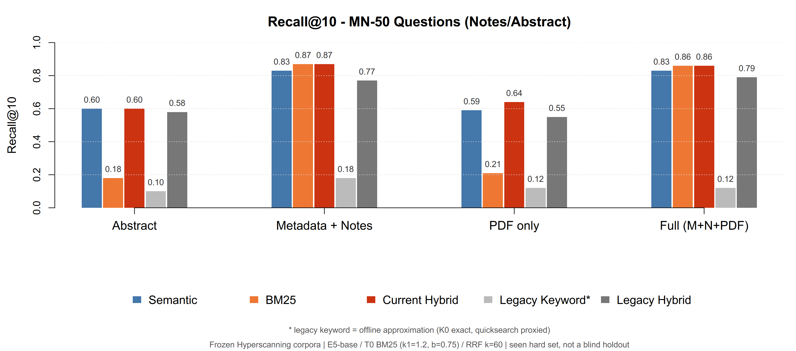
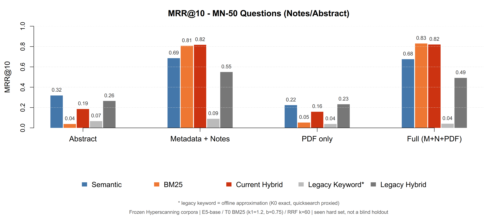
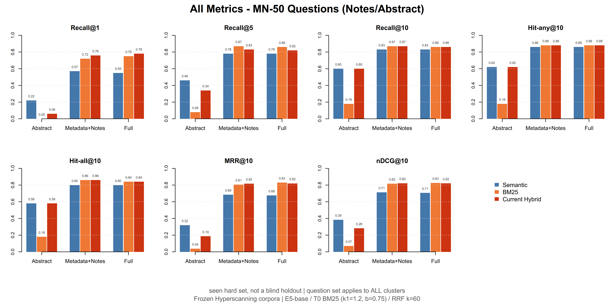
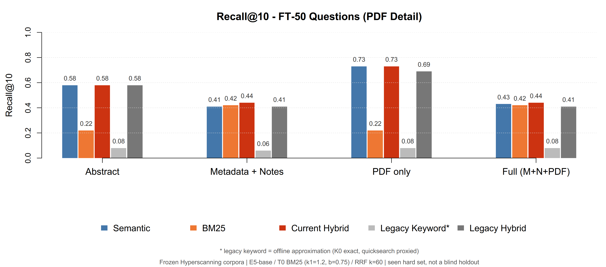
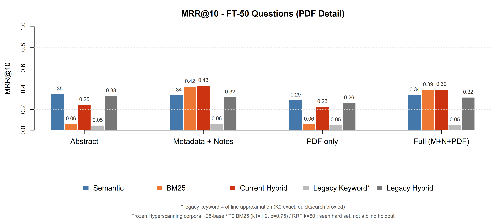
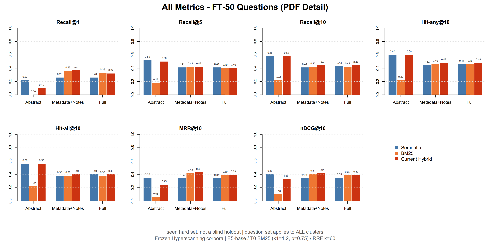
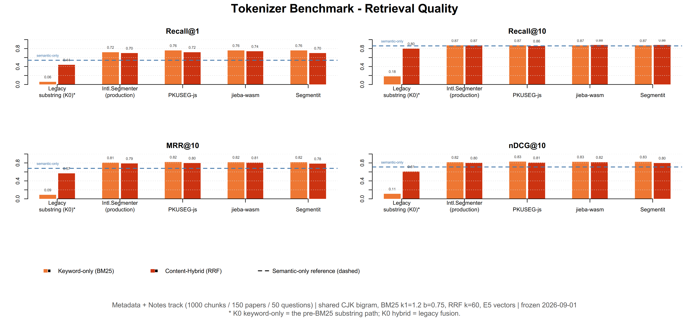
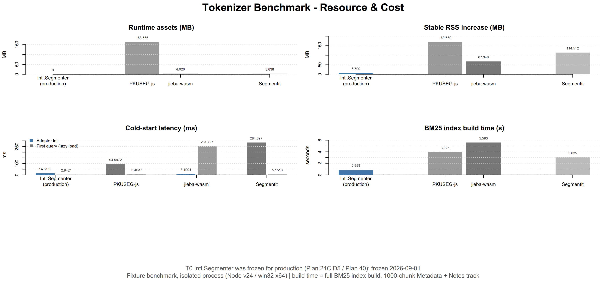
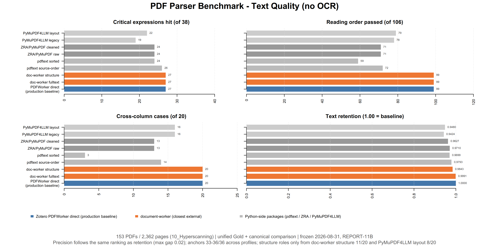
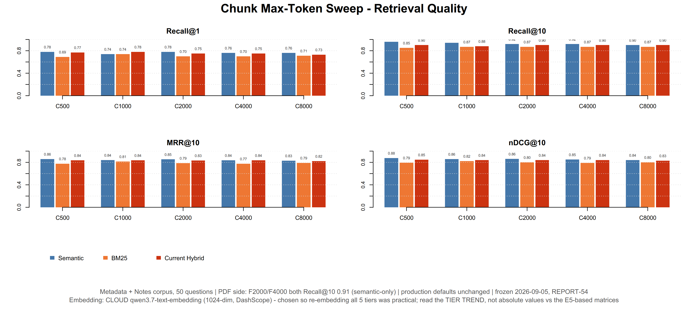

# 搜索架构（中文版）

> **说明（ZotSeek-U fork）：** 本文件是 fork 搜索/分块架构文档的**中文母本**；英文对照版见 [SEARCH_ARCHITECTURE_EN.md](SEARCH_ARCHITECTURE_EN.md)。搜索或索引行为变化时两份必须同步更新。文中的 ASCII 架构图与代码块刻意与英文版保持逐字一致，便于与源码对照。

本文档完整说明 ZotSeek 的语义检索与 Hybrid 混合搜索是如何工作的。

---

## Plan 62 实施状态（2026-09-09）

Plan 62 已接入启动末尾与现有“检查并更新索引”入口。BM25 准备期间搜索等待共享任务；匹配快照则加载，过期则释放旧版后构建，不同时保留两版。普通新增、编辑、删除允许保持会话内旧内容；缺失条目返回 item_not_found，中文界面显示“条目不存在”。向量与身份缓存保持即时失效。

## 目录

1. [总览](#总览)
2. [搜索模式](#搜索模式)
3. [搜索方案](#搜索方案)
4. [Hybrid 搜索与 RRF](#hybrid-搜索与-rrf)
5. [多查询搜索](#多查询搜索)
6. [语义检索管线](#语义检索管线)
7. [BM25 管线](#bm25-管线)
8. [分块策略](#分块策略)
   - [模型感知的 maxTokens](#模型感知的-maxtokens)
   - [结构化 Child Note 分块](#结构化-child-note-分块)
   - [PDF 正文前处理](#pdf-正文前处理)
   - [索引模式增量切换](#索引模式增量切换)
   - [截断检测（每篇最大 chunk 数）](#截断检测每篇最大-chunk-数)
9. [按章节感知的分块](#按章节感知的分块)
   - [References 过滤](#references-过滤)
10. [性能优化](#性能优化)
11. [Embedding 模型注册表](#embedding-模型注册表)
    - [Local Server 嵌入](#local-server-嵌入)
    - [Cloud 嵌入](#cloud-嵌入)
12. [数据库 Schema](#数据库-schema)
    - [Child Note 路径（Schema v11）](#child-note-路径schema-v11)
    - [精确 PDF 来源（Schema v12）](#精确-pdf-来源schema-v12)
13. [查询分析](#查询分析)
14. [配置](#配置)
15. [总结](#总结)


---

## 总览

ZotSeek 的搜索由三层机制组成：**身份导航**（先在 Zotero 元数据上解析 DOI、标题、作者类查询）、**语义与关键词分支的 RRF 融合**（语义嵌入为一侧；关键词分支由 T0 BM25 与 Zotero quicksearch 合并而成），以及 Full 模式专属的**来源感知分配**。用户可见的搜索模式（语义 / 关键词 / Hybrid）只是这三层机制的不同组合方式；底层机制与开销见[搜索方案](#搜索方案)，各管线的实现细节见[语义检索管线](#语义检索管线)与 [BM25 管线](#bm25-管线)。

```
┌─────────────────────────────────────────────────────────────────────────────┐
│                  SEARCH ARCHITECTURE OVERVIEW (ZotSeek-U)                   │
├─────────────────────────────────────────────────────────────────────────────┤
│                                                                             │
│                                 USER QUERY                                  │
│                                      │                                      │
│                                      ▼                                      │
│          ┌────────────────────────────────────────────────────────┐         │
│          │IDENTITY NAVIGATION (metadata-only prepass)             │         │
│          │exact DOI / full title / distinctive title              │         │
│          │fragment (>=3 Latin words or >=6 CJK chars)             │         │
│          │author name -> author collection                        │         │
│          └────────────────────────────────────────────────────────┘         │
│                                      │  concept query (no identity match)   │
│                                      ▼                                      │
│┌────────────────────────────────────────────────────────┐                   │
││MODE-AWARE CONTENT STRATEGY (search-policy.ts)          │                   │
│└──────┬───────────────────┬────────────────────┬────────┘                   │
│                 │                   │                    │                  │
│             abstract              notes                full                 │
│          ┌─────────────┐  ┌───────────────────┐ ┌─────────────────┐         │
│          │semantic-only│  │R1 Notes semantic  │ │Notes + PDF      │         │
│          │content path │  │+ T0 BM25 lexical  │ │semantic         │         │
│          │(R1 Summary) │  │RRF fusion (k=60)  │ │specialists      │         │
│          │             │  │                   │ │Notes -> top 2   │         │
│          │             │  │                   │ │PDF -> fills tail│         │
│          └─────────────┘  └───────────────────┘ └─────────────────┘         │
│                                                                             │
│T0 BM25: Intl.Segmenter(zh-Hans) natural terms + CJK bigrams;                │
│BM25 (k1=1.2, b=0.75), zero third-party dependencies                         │
│                                                                             │
│User-facing modes: Semantic / Keyword / Hybrid (default)                     │
│Keyword branch = T0 BM25 over chunk text + Zotero quick                      │
│search, merged per item. Identity prepass reads Zotero                       │
│metadata only. Explicit semantic / keyword selection                         │
│bypasses the default strategy.                                               │
│                                                                             │
└─────────────────────────────────────────────────────────────────────────────┘
```


---

## 搜索模式

### 🔗 Hybrid（推荐）

Hybrid 是产品默认入口，按三层执行：

1. **身份导航**：先在 Zotero 元数据上解析查询——精确 DOI、完整标题、唯一且有区分度的标题片段（Latin 至少 3 个词且 12 个字符；连续 CJK 至少 6 个字符）直接返回对应文献，作者名返回作者文献集合。候选都经原始 Zotero Search 门验证；较弱或含糊的片段主动弃权，落入内容路径。
2. **语义 + 关键词分支 RRF 融合**：语义侧用嵌入与 MaxSim 排名；关键词分支由 T0 BM25（对本地已索引 chunk 文本）与 Zotero quicksearch（元数据 + 启发式重排）按条目合并而成。两路用 RRF（`k=60`）融合。
3. **来源感知分配（仅 Full 模式）**：Notes specialist 结果占据前二头部槽位，PDF 语义结果去重后补齐尾部。

按索引模式选择的内容策略：

| 索引模式 | 默认内容策略 |
|---------------|--------------------------|
| `abstract` | 仅语义（semantic-only） |
| `notes` | R1 Metadata + Notes 语义 + T0 BM25，RRF 融合（`k=60`） |
| `full` | Notes H1 specialist 前两篇，其余由 PDF 语义结果补齐 |

Full 模式的结果分配是来源感知的：对文献去重、让 PDF 填满尾部，仅当 PDF 无法填满请求数量时回退到剩余 Notes 结果。对 `topK=10` 这就是定稿的产品 `2+8` 契约。其他结果数同样最多保留两个 Notes 头部槽位。passages 粒度沿用同样的位置规则，但尚未经过 Plan 37 的文献级配对验证。

| 查询类型 | 纯语义 | 纯关键词 | Hybrid |
|------------|---------------|--------------|--------|
| "trust in AI" | ✅ 很好 | ❌ 差 | ✅ 很好 |
| "Smith 2023" | ❌ 差 | ✅ 很好 | ✅ 很好 |
| "RLHF" | ⚠️ 一般 | ✅ 仅精确命中 | ✅ 双通道 |
| "automation bias healthcare" | ✅ 好 | ⚠️ 部分 | ✅ 最佳 |

### 🧠 仅语义（Semantic Only）

显式选择语义模式时**绕过默认策略**：不跑关键词分支、不做来源分配；身份导航仍会先行（`abstract` 模式的默认内容路径就是它）。

**最适合：**
- 概念型查询："how does automation affect human decision making"
- 寻找使用了不同术语的相关工作
- 探索性研究

**局限：**
- 不理解作者名或年份
- 可能错过精确的技术术语

### 🔤 仅关键词（Keyword Only）

显式选择关键词模式时同样绕过默认策略，单独运行关键词分支：**T0 BM25**（对本地已索引 chunk 文本，覆盖 Notes/PDF 正文中的精确词项）与 **Zotero quicksearch**（元数据检索 + 启发式重排）合并成一个排名。

**最适合：**
- 作者检索："Smith 2023"
- 精确术语："PRISMA 2020"
- 标签过滤
- 笔记或 PDF 正文中的原文精确短语

**局限：**
- 无语义理解
- 找不到同义词或相关概念


---

## 搜索方案

搜索模式是用户可见的入口；本章说明模式脚下的检索机制——原版 ZotSeek 提供了什么、fork 为什么新增 BM25、以及引入它的开销。

### 原版方案：语义搜索 + 关键词搜索

**语义搜索**把查询与 chunk 都映射成嵌入向量，用余弦相似度排名，再以 MaxSim 聚合到文献粒度（实现细节见[语义检索管线](#语义检索管线)）。它擅长概念匹配与换措辞命中，但不懂作者、年份，对精确术语也不可靠。

**关键词搜索**使用 Zotero 内置 quick search（`quicksearch-everything` 或 `quicksearch-titleCreatorYear`）检索标题、作者、年份、标签等元数据。quick search 不按相关性排序，所以插件自己做启发式重排：标题词命中最多 +0.3、全部词都在标题中再 +0.15、年份命中 +0.15、作者姓命中 +0.10，总分上限 1.0（评分细节见[查询分析](#查询分析)）。它擅长身份类查询与精确术语，但没有语义泛化能力。

原版 Hybrid 就是这两路的 RRF 融合。它的缺口在于：quick search 不索引笔记与 PDF 正文；要命中元数据之外的正文精确词，只能对数据库里的 chunk 文本做 `LOWER(chunk_text) LIKE` 包含扫描——这条路径随 Full 模式语料线性变慢，实测 150 篇 Full 语料（8,873 chunks、约 900 万字符）上 keyword 分支 5.71 秒、语义侧只要 1.81 秒。

### 新增：T0 BM25 词法通道

fork 用经典 **BM25** 排名取代了 LIKE 包含扫描：对本地已索引 chunk 文本建倒排索引，按词项频率与逆文档频率打分。分词采用**零第三方依赖**的 T0 契约——`Intl.Segmenter('zh-Hans')` 自然词 + CJK bigram 双通道（实现细节见 [BM25 管线](#bm25-管线)）。

它解决两个问题：

- **正文精确命中**：Notes/PDF 里的原文词项（药物名、缩写、方法名）由倒排索引保证召回，不再依赖嵌入的语义相似度；
- **规模可控**：BM25 只沿查询命中的词项遍历 postings，复杂度与语料规模的关系远好于逐 chunk 的 `LIKE` 全文扫描。

quick search **没有被移除**：它继续负责元数据面的检索，与 BM25 的命中按条目合并成"关键词分支"，再与语义侧做 RRF。所以今天的 Hybrid 实际上是三套机制的糅合——语义嵌入 + Zotero 元数据关键词 + 正文 BM25——外加最前面的身份导航。

### 开销

BM25 的成本主要落在三处：

- **数据库容量**：BM25 的语料就是数据库里逐 chunk 保存的忠实 `chunk_text`，这些文本必须完整保留在 `zotseek.sqlite` 中、不能为省空间而裁剪。实测 150 篇 Full 语料 8,894 个 chunks 约 903 万字符，`chunk_text` 占库 8.3 MiB（全库 44 MiB，其中向量本体占 31.3 MiB）。
- **进程内存**：CSR 索引准备好后常驻，退出释放，磁盘快照保留。持久化主要节省重建计算，不代表常驻内存自动降低。
- **冷构建延迟**：Plan 40B 的旧版 150 篇库曾测得 4.4–6.5 秒，不能外推大库。Plan 62 将准备移到启动维护末尾；快照复用避免重新分词。JSON 解析/序列化仍有同步阶段，需单独测量。

热查询命中缓存后，BM25 分支的额外开销很小；`abstract` 等不含 Notes/PDF 正文的模式语料更小、构建更快。


---

## Hybrid 搜索与 RRF

### 什么是 Reciprocal Rank Fusion？

RRF 是一种合并多个搜索系统排序列表的技术，不需要分数归一化，也不需要调参。

```
                    RECIPROCAL RANK FUSION (RRF)
                    ════════════════════════════

    Formula:  RRF_score(doc) = Σ 1/(k + rank_i)

    Where:
    • k = constant (default: 60, from original RRF paper)
    • rank_i = document's rank in each result list

    ┌─────────────────────────────────────────────────────────────────┐
    │ EXAMPLE: Query "Smith automation bias healthcare"               │
    ├─────────────────────────────────────────────────────────────────┤
    │                                                                 │
    │ SEMANTIC SEARCH (by similarity):                                │
    │ ┌────┬──────────────────────────────────────────┬─────────┐    │
    │ │Rank│ Paper                                    │ Score   │    │
    │ ├────┼──────────────────────────────────────────┼─────────┤    │
    │ │ 1  │ Automation bias in clinical AI systems   │ 89%     │    │
    │ │ 2  │ Human-AI decision making in medicine     │ 85%     │    │
    │ │ 3  │ Trust calibration for automated systems  │ 82%     │    │
    │ └────┴──────────────────────────────────────────┴─────────┘    │
    │                                                                 │
    │ KEYWORD BRANCH (BM25 + quicksearch):                            │
    │ ┌────┬──────────────────────────────────────────┬─────────┐    │
    │ │Rank│ Paper                                    │ Score   │    │
    │ ├────┼──────────────────────────────────────────┼─────────┤    │
    │ │ 1  │ Smith, J. - "Bias in ML systems"         │ 95%     │    │
    │ │ 2  │ Automation bias in clinical AI systems   │ 90%     │    │
    │ │ 3  │ Healthcare AI ethics review              │ 85%     │    │
    │ └────┴──────────────────────────────────────────┴─────────┘    │
    │                                                                 │
    │ RRF FUSION (k=60):                                              │
    │ ┌────────────────────────────────────────────────────────────┐ │
    │ │                                                            │ │
    │ │ "Automation bias in clinical AI systems"                   │ │
    │ │   Semantic: rank 1 → 1/(60+1) = 0.0164                    │ │
    │ │   Keyword:  rank 2 → 1/(60+2) = 0.0161                    │ │
    │ │   TOTAL: 0.0325  ← HIGHEST (appears in BOTH!)             │ │
    │ │                                                            │ │
    │ │ "Smith, J. - Bias in ML systems"                          │ │
    │ │   Semantic: not found → 0                                  │ │
    │ │   Keyword:  rank 1 → 1/(60+1) = 0.0164                    │ │
    │ │   TOTAL: 0.0164                                           │ │
    │ │                                                            │ │
    │ │ "Human-AI decision making in medicine"                     │ │
    │ │   Semantic: rank 2 → 1/(60+2) = 0.0161                    │ │
    │ │   Keyword:  not found → 0                                  │ │
    │ │   TOTAL: 0.0161                                           │ │
    │ │                                                            │ │
    │ └────────────────────────────────────────────────────────────┘ │
    │                                                                 │
    │ FINAL RANKING:                                                  │
    │ 1. 🔗 Automation bias in clinical AI   (0.0325) - BOTH        │
    │ 2. 🔤 Smith, J. - Bias in ML systems   (0.0164) - Keyword     │
    │ 3. 🧠 Human-AI decision making         (0.0161) - Semantic    │
    │                                                                 │
    └─────────────────────────────────────────────────────────────────┘
```

> 图中右侧的 "KEYWORD BRANCH" 并不是单纯的元数据搜索：它由 **T0 BM25**（对本地已索引 chunk 文本）与 **Zotero quicksearch**（元数据 + 启发式重排）的命中按条目合并而成，合并规则见[查询分析](#查询分析)。

### 三层默认管线

Hybrid 默认入口的完整管线如下图。注意 Layer 3 只在 `full` 模式存在；`notes` 模式的 Layer 2 结果直接返回，`abstract` 模式在身份导航后只跑语义侧。

```
┌─────────────────────────────────────────────────────────────────────────────┐
│                   HYBRID DEFAULT PIPELINE (three layers)                    │
├─────────────────────────────────────────────────────────────────────────────┤
│                                                                             │
│                                 USER QUERY                                  │
│                                      │                                      │
│                                      ▼                                      │
│    ┌────────────────────────────────────────────────────────────────────┐   │
│    │LAYER 1 - IDENTITY NAVIGATION (metadata prepass)                    │   │
│    │exact DOI / full title / distinctive title fragment                 │   │
│    │(Latin >= 3 words & 12 chars, CJK >= 6 chars)                       │   │
│    │author name -> author collection; candidates                        │   │
│    │validated through the original Zotero Search gate                   │   │
│    └────────────────────────────────────────────────────────────────────┘   │
│                                      │  content query (no identity match)   │
│                                      ▼                                      │
│    │LAYER 2 - RRF FUSION (k=60)                                         │   │
│    │                                                                    │   │
│    │  ┌────────────────────┐          ┌──────────────────────────┐      │   │
│    │  │semantic list       │          │keyword branch            │      │   │
│    │  │embeddings +        │          │T0 BM25 over chunk        │      │   │
│    │  │MaxSim per paper    │          │text + Zotero             │      │   │
│    │  │                    │          │quicksearch, merged       │      │   │
│    │  │                    │          │per item                  │      │   │
│    │  └────────────────────┘          └──────────────────────────┘      │   │
│    │                                                                    │   │
│    │fused by Reciprocal Rank Fusion (k=60)                              │   │
│    └─────────────────────────────────┬──────────────────────────────────┘   │
│                                      │                                      │
│                                      ▼                                      │
│    ┌────────────────────────────────────────────────────────────────────┐   │
│    │LAYER 3 - FULL MODE ONLY: SOURCE ALLOCATION                         │   │
│    │Notes specialist owns the top-2 head slots;                         │   │
│    │PDF semantic results fill the tail (2+8 at topK=10)                 │   │
│    └────────────────────────────────────────────────────────────────────┘   │
│                                                                             │
│notes mode    = Layer 2 result directly (R1 semantic + T0 BM25)              │
│abstract mode = identity navigation + semantic-only content                  │
│explicit semantic / keyword selection bypasses Layer 2 fusion                │
│                                                                             │
└─────────────────────────────────────────────────────────────────────────────┘
```

### 为什么选择 RRF？

| 特性 | 收益 |
|----------|---------|
| **无需分数归一化** | 基于排名而非原始分数工作 |
| **无需调参** | k=60 在各领域表现良好 |
| **稳健** | 任何来源的头部结果都会被提升 |
| **生产验证** | Elasticsearch、Vespa、Pinecone 均在使用 |

融合的权重只有一个来源：自动权重调节开启时，查询分析在 Notes H1 specialist 内部调整语义/词法份额（见[查询分析](#查询分析)）；关闭时两者各占 50%。RRF 只消费排名——BM25 的原始分已在关键词分支内部归一化到 [0, 1]。

### 结果指示符

| 图标 | 含义 | 解读 |
|------|---------|----------------|
| 🔗 | 双通道命中 | 高置信度——语义与关键词同时匹配 |
| 🧠 | 仅语义 | 概念相关但措辞不同 |
| 🔤 | 仅关键词 | 精确命中但语义检索未覆盖 |

### 来源感知分配（Full 模式）

`full` 模式在 RRF 之后多做一步分配（`fullSourceAwareSearch()`）：

1. Notes specialist（R1 语义 + T0 BM25 的 RRF 结果）与 PDF 语义 specialist 各自产出独立排名；两个语义 specialist 共享一次查询嵌入、一次向量缓存过滤和一次点积遍历。
2. Notes 结果占据前 `FULL_NOTES_HEAD_SLOTS = 2` 个头部槽位。
3. PDF 语义结果按稳定身份去重后填满剩余槽位（`topK=10` 时即 `2+8`）。
4. PDF 不足时由剩余 Notes 结果回填。

该契约来自 Plan 37/40 的离线与实机验证；passages 粒度沿用同样的位置规则，但尚未经过文献级配对验证。


### 离线实测：四种索引内容 × 五种搜索方式

以下六张图来自 Plan 58 统一离线矩阵：冻结的 `10_Hyperscanning` 150 篇语料、MN-50 / FT-50 两套 50 题、
`multilingual-e5-base`、T0 BM25（k1=1.2 / b=0.75）、RRF k=60；primary 与独立 replay 逐字节一致，
11 项历史 binding 六位小数通过，完整数字见 `plan/REPORT-58`。同一张图内四个簇共用同一套题，
跨簇差异直接反映"索引内容决定召回上限"；`keyword-legacy` 的元数据部分为离线近似。

**MN-50 题（Notes/摘要题口径）：**





全指标面板（3 种生产索引模式 × 3 种现行方式，7 项指标一览；纯PDF 为研究轨道，不是生产索引模式，不入此图）：



**FT-50 题（PDF 精细题口径）：**





全指标面板（FT 口径）：



几个可以直接从图中读出的结论：

- Metadata + Notes 模式上现行 Hybrid 达到 R@10 0.87 / MRR 0.817，是该口径的最优项；BM25 单独已有
  0.87——T0 词法升级是现行 Hybrid 相对旧 Hybrid（MRR 0.549）的主要增益来源。
- 摘要模式上词法证据过弱：现行 Hybrid 的前排（R@1 0.06）反而低于纯语义（0.22），这正是生产为
  `abstract` 模式默认 semantic-only 的数字依据。
- FT 题只有含 PDF 正文的簇能拿到高召回：PDF only 簇语义 R@10 0.73，Metadata + Notes 簇只有
  0.41–0.44；全文模式按上一节的 `FIXED-NOTES-2-8` 生产契约可达 FT R@10 0.78 / MRR 0.499。
- 旧关键词路径（quicksearch 代理 + K0）在中文内容题上接近失效（R@10 ≤ 0.18），这是历史上用
  T0 BM25 替换它的直接依据。

---

## 多查询搜索

ZotSeek 支持将最多 4 个搜索查询用 AND/OR 逻辑组合，找到位于多个主题交叉点上的论文。

```
┌─────────────────────────────────────────────────────────────────────────────┐
│                      MULTI-QUERY SEARCH ARCHITECTURE                        │
├─────────────────────────────────────────────────────────────────────────────┤
│                                                                             │
│  USER INPUT:                                                                │
│  ┌───────────────────────────────────────────────────────────────────────┐ │
│  │ Query 1: "machine learning"                                           │ │
│  │ Query 2: "healthcare"                                                 │ │
│  │ Query 3: "ethics"                                                     │ │
│  │ Operator: AND (Product formula)                                       │ │
│  └───────────────────────────────────────────────────────────────────────┘ │
│                               │                                           │
│                               ▼                                           │
│  PARALLEL EXECUTION:                                                       │
│  ┌─────────────────┐  ┌─────────────────┐  ┌─────────────────┐            │
│  │ Search Q1       │  │ Search Q2       │  │ Search Q3       │            │
│  │ "machine        │  │ "healthcare"    │  │ "ethics"        │            │
│  │  learning"      │  │                 │  │                 │            │
│  └────────┬────────┘  └────────┬────────┘  └────────┬────────┘            │
│           │                    │                    │                      │
│           ▼                    ▼                    ▼                      │
│  ┌───────────────────────────────────────────────────────────────────────┐ │
│  │ Paper A: [0.85, 0.72, 0.68]  ← scores from each query                 │ │
│  │ Paper B: [0.91, 0.45, null]  ← missing Q3 = excluded by AND           │ │
│  │ Paper C: [0.78, 0.81, 0.75]  ← all queries match                      │ │
│  └───────────────────────────────────────────────────────────────────────┘ │
│                               │                                           │
│                               ▼                                           │
│  SCORE COMBINATION (AND with Product formula):                             │
│  ┌───────────────────────────────────────────────────────────────────────┐ │
│  │ Paper A: (0.85×0.72×0.68)^(1/3) = 0.746                               │ │
│  │ Paper B: EXCLUDED (doesn't match all queries)                         │ │
│  │ Paper C: (0.78×0.81×0.75)^(1/3) = 0.779  ← HIGHEST                    │ │
│  └───────────────────────────────────────────────────────────────────────┘ │
│                               │                                           │
│                               ▼                                           │
│  FINAL RANKING:                                                            │
│  ┌───────────────────────────────────────────────────────────────────────┐ │
│  │ 1. Paper C: 78% (78|81|75)  ← combined score (per-query scores)       │ │
│  │ 2. Paper A: 75% (85|72|68)                                            │ │
│  └───────────────────────────────────────────────────────────────────────┘ │
│                                                                             │
└─────────────────────────────────────────────────────────────────────────────┘
```

### AND/OR 组合

| 算子 | 行为 | 结果集 |
|----------|----------|------------|
| **AND** | 文献必须命中全部查询 | 交集——更严格、结果更少 |
| **OR** | 命中任一查询即可 | 并集——更宽、结果更多 |

**AND 模式：**
- 只包含在全部查询结果中都出现的文献
- 合并分数由所选公式决定，默认为 Product（几何平均）（见下文）
- 最适合寻找多个主题交叉点上的论文

**OR 模式：**
- 出现在任一查询结果中的文献都包含
- 合并分数 = 所有查询中的最高分
- 最适合用同义词或相关词扩大检索面

### AND 组合公式

AND 模式下有三种公式可用于合并分数，默认为 **Product（几何平均）**：

默认选择 Product 的依据是 Plan 59 的离线复现探针：在共享 Gold 配对上，Product/average 命中
Top10 6/6（可达成上限），min 只有 4/6。min 只取最弱一侧分数，会把合并分挤压到一个很窄的区间，
在专业文库中容易让"对每条查询都不错"的综述型文献排在真正的目标文献之前；Product 对各侧分数
更均衡，同时对"某一侧偏弱"的惩罚仍强于 average。需要最严格交集时可手动切换回 Minimum。

```
┌─────────────────────────────────────────────────────────────────────────────┐
│                     AND COMBINATION FORMULAS                                │
├─────────────────────────────────────────────────────────────────────────────┤
│                                                                             │
│  Example: Paper scores for 3 queries = [0.85, 0.72, 0.68]                   │
│                                                                             │
│  ┌───────────────────────────────────────────────────────────────────────┐ │
│  │ MINIMUM (strictest)                                                   │ │
│  │ Formula: min(scores)                                                  │ │
│  │ Result:  min(0.85, 0.72, 0.68) = 0.68                                 │ │
│  │                                                                       │ │
│  │ Behavior: Score limited by weakest query match                        │ │
│  │ Use when: You want strict intersection - paper must be                │ │
│  │           strongly relevant to ALL queries                            │ │
│  └───────────────────────────────────────────────────────────────────────┘ │
│                                                                             │
│  ┌───────────────────────────────────────────────────────────────────────┐ │
│  │ PRODUCT (default)                                                     │ │
│  │ Formula: (∏ scores)^(1/n) = nth root of product                       │ │
│  │ Result:  (0.85 × 0.72 × 0.68)^(1/3) = 0.746                           │ │
│  │                                                                       │ │
│  │ Behavior: Penalizes if ANY query is weak, but less harsh than min     │ │
│  │ Use when: You want balanced relevance across all queries              │ │
│  └───────────────────────────────────────────────────────────────────────┘ │
│                                                                             │
│  ┌───────────────────────────────────────────────────────────────────────┐ │
│  │ AVERAGE (arithmetic mean)                                             │ │
│  │ Formula: Σ scores / n                                                 │ │
│  │ Result:  (0.85 + 0.72 + 0.68) / 3 = 0.75                              │ │
│  │                                                                       │ │
│  │ Behavior: Most lenient - one strong match can compensate for weak     │ │
│  │ Use when: You want papers that are good overall, even if              │ │
│  │           one query matches less strongly                             │ │
│  └───────────────────────────────────────────────────────────────────────┘ │
│                                                                             │
│  COMPARISON:                                                                │
│  ┌────────────┬────────────┬────────────┬─────────────────────────────┐   │
│  │ Formula    │ Result     │ Strictness │ Ranking Impact              │   │
│  ├────────────┼────────────┼────────────┼─────────────────────────────┤   │
│  │ Minimum    │ 0.68       │ Strictest  │ Rewards consistent matches  │   │
│  │ Product    │ 0.746      │ Moderate   │ Balanced consideration      │   │
│  │ Average    │ 0.75       │ Lenient    │ Favors strong single match  │   │
│  └────────────┴────────────┴────────────┴─────────────────────────────┘   │
│                                                                             │
└─────────────────────────────────────────────────────────────────────────────┘
```

### 实现细节

```typescript
// Parallel search execution
const searchPromises = queries.map(query =>
  hybridSearch.search(query, options)
);
const allResults = await Promise.all(searchPromises);

// Score combination
const combinedScore = operator === 'and'
  ? applyAndFormula(scores, formula)  // min, product, or average
  : Math.max(...scores);               // OR uses max

// Per-query scores stored for display
result.queryScores = [0.85, 0.72, 0.68];  // Individual scores
result.semanticScore = 0.68;              // Combined score
```

### 展示格式

Match 列显示合并分数以及各查询的分解分数：

```
75% (85|72|68)
 │    └──┴──┴── Individual query scores (Q1|Q2|Q3)
 └───────────── Combined score using selected formula
```

这帮助用户理解哪些查询匹配强、哪些较弱。

---

## 语义检索管线

### Embedding 生成

```
┌────────────────────────────────────────────────────────────────────┐
│                  EMBEDDING PIPELINE (model-aware)                  │
├────────────────────────────────────────────────────────────────────┤
│                                                                    │
│  INPUT TEXT (exact-token counted)      EMBEDDING VECTOR            │
│  ┌─────────────────────────┐           ┌─────────────────────┐     │
│  │ "Machine learning for   │           │ [0.023, -0.045,     │     │
│  │  medical diagnosis ..." │   --->    │  0.012, ... 768 or  │     │
│  │                         │           │  1024 values]       │     │
│  └─────────────────────────┘           └─────────────────────┘     │
│                                                                    │
│  MODEL REGISTRY (model-registry.ts / model-input-config.ts)        │
│  ┌──────────────────────────────────────────────────────────┐      │
│  │ multilingual-e5-base    768   512       bundled default  │      │
│  │ nomic-embed-text-v1.5   768   8192      optional download│      │
│  │ bge-m3                  1024  8192      optional download│      │
│  └──────────────────────────────────────────────────────────┘      │
│                                                                    │
│  INSTRUCTION PREFIXES (registry-driven, model-aware):              │
│  ├── E5:      "query: " / "passage: "                              │
│  ├── Nomic:   "search_query: " / "search_document: "               │
│  └── BGE-M3:  none                                                 │
│                                                                    │
│  TOKEN COUNTING:                                                   │
│  ├── E5 / BGE-M3: exact local tokenizer (prefix + special tokens)  │
│  └── Nomic / server / cloud: conservative word estimator           │
│                                                                    │
└────────────────────────────────────────────────────────────────────┘
```

### 余弦相似度

```
                         COSINE SIMILARITY
                         ═════════════════

                              A · B
    similarity(A, B) = ─────────────────
                        ||A|| × ||B||

    Where:
    • A · B = dot product = Σ(a[i] × b[i])
    • ||A|| = magnitude = √(Σ a[i]²)

    ┌─────────────────────────────────────────────────────────────┐
    │ INTERPRETATION:                                             │
    ├─────────────────────────────────────────────────────────────┤
    │                                                             │
    │  1.0 ████████████████████████████████████ Identical        │
    │  0.9 ███████████████████████████████████  Very similar     │
    │  0.7 █████████████████████████████        Related topics   │
    │  0.5 ███████████████████                  Loosely related  │
    │  0.3 ███████████                          Different topics │
    │  0.0                                       Completely different│
    │                                                             │
    └─────────────────────────────────────────────────────────────┘
```

### MaxSim 聚合

当一篇论文有多个 chunk 时，我们使用 **MaxSim**（最大相似度）：

```
    Paper A has 4 chunks: [summary, methods, findings, content]

    Query: "statistical analysis techniques"

    Similarities:
    ├── summary:  0.45  (abstract mentions statistics)
    ├── methods:  0.89  ← HIGHEST (detailed methods section)
    ├── findings: 0.52  (results discuss significance)
    └── content:  0.32  (background section)

    MaxSim Result: 0.89 (methods chunk matched best)
    Source Display: "Methods" ← Shows WHERE the match was found
```

这保证只要论文的**任何**部分匹配查询，该论文就能排到前面。

### 片段富集（命中段落预览）

评分循环刻意只在向量上工作：内存嵌入缓存（`getAllCached()`）只保存向量加轻量元数据（条目身份、chunk 索引、页码/段落、章节），**不保存 chunk 文本**。把 `chunk_text` 排除在缓存之外，可避免大文库占用数百 MB 内存。

命中段落是懒加载的，只为用户实际可见的行获取：

```
    1. Score all chunks → MaxSim per item → sort by similarity
    2. slice(0, topK)                ← typically 20-50 rows
    3. populateChunkText(topResults) ← batch-fetch chunk_text for the
                                        matchedChunkIndex of each visible row
                                        (VectorStoreSQLite.getChunkTexts)
    4. result.chunkText is now set → UI shows it on hover
```

`getChunkTexts()` 针对可见行的 `matchedChunkIndex`，在活动模型范围内、以 `topK` 为界，并行发起单列查询获取 `chunk_text`、可选的 `section_paths` 与 `pdf_attachment_key`，遵循 Zotero 8 单列查询约定。把这些展示/溯源字段排除在全量向量缓存之外，其内存成本就不会随全库索引增长。`chunk_text` 自 schema v6 起存储；schema v11 增加结构化 Child Note 路径，schema v12 增加精确 PDF 来源。

UI（`SearchResultsTable`）将 `chunkText` 渲染为行悬停时的浮动提示，围绕第一个命中的查询词开窗并高亮这些词（仅 keyword/hybrid 模式）。

### 父子检索模式

ZotSeek 实现**父子检索模式**，支持两种粒度：

```
┌─────────────────────────────────────────────────────────────────────┐
│                   PARENT-CHILD RETRIEVAL                             │
├─────────────────────────────────────────────────────────────────────┤
│                                                                      │
│  INDEXING: Paragraph-level (child chunks)                           │
│  ┌─────────────────────────────────────────────────────────────┐   │
│  │ Paper A                                                      │   │
│  │ ├── Chunk 0: Abstract (page 1, para 0)                      │   │
│  │ ├── Chunk 1: Intro paragraph 1 (page 2, para 0)             │   │
│  │ ├── Chunk 2: Intro paragraph 2 (page 2, para 1)             │   │
│  │ ├── Chunk 3: Methods paragraph 1 (page 3, para 0)           │   │
│  │ └── ...                                                      │   │
│  └─────────────────────────────────────────────────────────────┘   │
│                              │                                       │
│              ┌───────────────┴───────────────┐                      │
│              ▼                               ▼                       │
│  ┌─────────────────────┐         ┌─────────────────────┐           │
│  │  BY SECTION MODE    │         │  BY LOCATION MODE   │           │
│  │  (returnAllChunks   │         │  (returnAllChunks   │           │
│  │   = false)          │         │   = true)           │           │
│  ├─────────────────────┤         ├─────────────────────┤           │
│  │                     │         │                     │           │
│  │ MaxSim aggregation  │         │ Return ALL chunks   │           │
│  │ 1 result per paper  │         │ with individual     │           │
│  │ Best chunk score    │         │ scores & locations  │           │
│  │                     │         │                     │           │
│  │ Result:             │         │ Results:            │           │
│  │ Paper A: 89%        │         │ Paper A, p3 ¶0: 89% │           │
│  │ (Methods section)   │         │ Paper A, p2 ¶1: 52% │           │
│  │                     │         │ Paper A, p1 ¶0: 45% │           │
│  └─────────────────────┘         └─────────────────────┘           │
│                                                                      │
└─────────────────────────────────────────────────────────────────────┘
```

#### 按章节模式（默认）

- **聚合方式**：MaxSim——取所有 chunk 中的最高相似度
- **结果**：每篇论文 1 条结果
- **展示**：显示命中的章节（Abstract、Methods、Results）**以及该最佳匹配 chunk 的位置**（页码与段落）。MaxSim 结果本身携带最佳 chunk 的 `pageNumber`/`paragraphIndex`，因此 Location 列在此模式下也会填充——每篇论文一条多样化结果的同时不丢失精确位置。仅关键词命中或仅摘要索引时回退为 "—"。
- **使用场景**：概览哪些论文匹配

#### 按位置模式

- **聚合方式**：无——返回每个命中的 chunk
- **结果**：每篇论文多条结果（每个命中段落一条）
- **展示**：显示精确的页码与段落号
- **使用场景**：定位具体段落、证据链接

#### 技术实现

```typescript
// Search options
interface SearchOptions {
  returnAllChunks?: boolean;  // true = By Location, false = By Section
}

// RRF fusion key changes based on mode
const key = returnAllChunks
  ? `${itemId}-${chunkIndex}`  // Unique per chunk
  : String(itemId);            // Unique per paper
```

---

## BM25 管线

本章与[语义检索管线](#语义检索管线)平行，说明关键词分支中 T0 BM25 的实现（`src/core/lexical-search.ts` 与 `vector-store-sqlite.ts` 的词法缓存）。分块产出的忠实 `chunk_text` 就是 BM25 的语料来源。

### 分词：T0 契约

- **归一化**：NFC 规范化 + 语言无关小写（`toLocaleLowerCase('und')`）。
- **自然词通道**：`Intl.Segmenter('zh-Hans', { granularity: 'word' })`，保留 `isWordLike` 且含字母/数字的词项；针对 Gecko 的错误标记，允许仅含泰文脚本字符/组合标记且含字母的非 word-like 片段。Zotero 9+ 内置该 API；无 Segmenter 的运行时回退到确定性的 `\p{L}\p{N}` 正则切词，CJK 通道不受影响。
- **韩英边界补偿**：若实际分段把英文与 Hangul 合并（如 `EEG로`），保留原分段并补出其中的拉丁字母起始词项；按实际出现次数累计，不重复补已独立分出的英文。仅含英文的文本跳过边界检查。不提供通用助词剥离、任意子串或词形还原。
- **CJK bigram 通道**：对连续的 Han/Hiragana/Katakana/Hangul 字串取相邻二元组。中文没有空格分词，bigram 保证任意两字组合都能命中；自然词通道保证完整词的精确性。
- 两通道产生的同一词项取**最大 TF**。
- 冻结契约 ID：`intl-segmenter-zh-hans-cjk-bigram-v2`（分词器）与 `chunk-bm25-k1-1.2-b-0.75-v1`（BM25 参数），标识应用层规则，索引与查询使用同一实现；不同运行时的原始切分仍可能不同。

为什么不用 jieba/pkuseg 等第三方分词器：Plan 24B/24C 消融显示 jieba-wasm（T2）检索指标最优，但约 4.03 MB WASM、约 67 MB 稳态内存与首次初始化成本不划算；零依赖的 T0 综合最优并已冻结为生产契约。全库关键词词典 patch（`library-term-patch-v1`）同样冻结为不启用。

仅升级词法规则无需重新生成 Embedding 或提取文本；启动时因算法合同不匹配而从已有 chunk_text 重建 BM25。软件版本变化本身不使快照失效。

### 倒排索引与打分

- **文档单元**是单个 chunk（`itemPk:chunkIndex`），文档长度 = 词项总数；`postings` 结构为词项 → (文档 → TF)。
- 打分是标准 BM25：

```
score(D, Q) = Σ IDF(t) · tf(t,D) · (k1 + 1) / ( tf(t,D) + k1 · (1 − b + b · |D| / avgLen) )
IDF(t)      = ln( 1 + (N − df + 0.5) / (df + 0.5) )              k1 = 1.2, b = 0.75
```

- **来源隔离深入到统计层**：`N`、`df` 与平均文档长度都在"当前查询允许的来源集合"内重新计算（Notes specialist 限 metadata/note 来源，PDF specialist 限 PDF 来源），而不是用全库统计再过滤结果——两个 specialist 看到的是两套自洽的语料统计。
- **文献粒度出口**：同一篇文献的多个 chunk 只取 BM25 最优者进入排名（确定性平局裁决：先比分数，再比 libraryKey/itemKey），避免单篇被多个碎块刷屏。
- **分数归一化**：BM25 原始分无上界，输出前按本次查询的最佳命中归一化到 [0, 1]——保持排序不变，同时便于与 quicksearch 启发式分（同为 0–1）合并及 UI 展示。
- 默认返回前 50 条命中（`limit`）。

### 缓存与生命周期

- BM25 使用内存 CSR 索引与独立 JSON 快照；启动和手动维护刷新，普通会话内写入不触发重建。
- 在途构建使用 generation/model/lifecycle 发布检查及 keyed single-flight。持久化修订号随 chunks 事务提交，关闭和重连不递增磁盘修订号。
- 准备期间搜索等待，构建分批让出主线程；已就绪 BM25 可保留会话内旧内容。清空、模型和生命周期变化仍拒绝不兼容旧版。
- **模型分区**：优先读活动模型的 chunk；尚未为新模型重建的论文用确定性选择的旧分区兜底，保证迁移期词法检索可用，且不会混入同一篇论文的两份副本。
- 构建诊断日志只输出规模（chunk 数、字符/字节数、唯一词项数、postings 数、耗时），不包含任何正文或查询文本。

构建成本与内存开销见[搜索方案](#搜索方案)；关键词分支与 quicksearch 命中的合并规则见[查询分析](#查询分析)。


### 分词器选型实测（Plan 24B/24C）

T0 并不是唯一被测过的分词器。Plan 24B 先用 BM25（K1）替换了旧的包含式匹配（K0），Plan 24C 再在
完全冻结的对照下横评了四个自然词分词器：**T0 `Intl.Segmenter`（生产选型）**、**T1 `PKUSEG-js`**、
**T2 `jieba-wasm@2.4.0`（search 模式）**、**T3 `Segmentit`**。四臂共享同一 CJK bigram 通道、
BM25 参数（k1=1.2 / b=0.75）、RRF k=60、E5 向量与同一 50 题集，只换自然词通道；主对比在
"元数据+笔记语料"（150 篇 / 1000 chunks）上进行，"纯PDF语料（剔除 2 篇中文枢纽）"仅用于确认
英文/缩写检索不受影响。



检索质量上，四个分词器把词法分支拉到同一水平（keyword-only R@1 0.72–0.76），**T2 jieba-wasm 的
content-hybrid 略胜**（R@1 0.74 / MRR 0.809 / nDCG 0.818；对 T0 为 R@1 +0.04、MRR +0.018）；
T1/T3 居中。蓝色虚线是没有词法分支时的纯语义水平——所有 BM25 分词器在 MRR/nDCG 上都高于该线，
说明融合本身有稳定增益。



资源成本决定了最终选型：**T2 质量最好，但需要 4 MB WASM 资产、约 67 MB 稳定内存增量、约 252 ms
首查懒加载，且 BM25 构建最慢（5.6 s）**；T1 需要约 163.5 MB 运行时资产与 170 MB 内存；T3 也要
114.5 MB。D5 权衡后冻结零依赖的 T0——增量收益不值得引入第三方 WASM 与常驻内存，后由 Plan 40
接入生产。同一轮消融还冻结了两件事：`library-term-patch-v1`（文库关键词词典）**HOLD_OFF**，
patch ON 无稳定检索收益（元数据+笔记语料 hybrid MRR +0.000032）反而增加索引 2.7%；两篇中文枢纽论文在任何
分词器下都占满纯PDF 词法 Top10，属于语料级风险而非分词器缺陷。完整数据见 `plan/archive/REPORT-24B`、
`plan/archive/REPORT-24C` 与 `tokenizer/eval/runs/plan24c-tokenizers-v1/2026-09-01-formal-report-v3/`。

---

## 分块策略

### 取舍：chunk 尺寸选择

Embedding 耗时随序列长度呈 **O(n²)** 增长（transformer 注意力所致）。chunk 尺寸同时影响索引速度与检索质量：

| chunk 尺寸 | 适用模型 | 速度（CPU/WASM） | 精度 | 召回 | 最适合 |
|------------|-----------|------------------|-----------|--------|----------|
| **420 tokens** | multilingual-e5-base（512 硬上限） | 很快（~0.4s/chunk） | 高 | 较低 | 具体论断、方法、段落 |
| **2000 tokens** | Nomic v1.5、BGE-M3（8192 硬上限） | 中等（~0.9s/chunk） | 均衡 | 均衡 | 长上下文本地模型 |
| **最高 4000 tokens** | Cloud 模型 profile（比率封顶） | 取决于 provider | 较低 | 较高 | 宽泛主题、长上下文 Cloud |

**精度 vs 召回：**
- **更小的 chunk** = 对具体段落的匹配更精确，但可能丢失更宽的上下文
- **更大的 chunk** = 覆盖更多上下文，但相似度得分会被周边文本"稀释"

### 模型感知的 maxTokens

默认值取决于活动模型：**multilingual E5 为 420 tokens**，**Nomic v1.5 与 BGE-M3 为 2000 tokens**。这些是 ZotSeek 的推荐值，不是模型上下文上限。显式的全局覆盖值会在模型切换时保留，并被钳制到活动模型的硬上限。在设置中清除覆盖值即可恢复当前模型的推荐值。

### 基于段落的分块

`maxTokens` 设置是**上限而不是目标**。chunker 会：

1. 在段落边界（`\n\n`）切分文本
2. 把段落累积进同一个 chunk
3. 当再加入一个段落会超过 `maxTokens` 时落盘当前 chunk
4. 超大段落先按句子边界拆分，仍未拆小的无标点单元再按 Unicode 字符边界拆分

```
Example with maxTokens=800:

Paragraph 1: 200 tokens  ─┐
Paragraph 2: 350 tokens   ├─► Chunk 1 (550 tokens)
                         ─┘
Paragraph 3: 400 tokens  ─┐
                          ├─► Chunk 2 (400 tokens) ← under limit, that's OK
                         ─┘
Paragraph 4: 900 tokens  ─┐
                          ├─► Chunk 3a + 3b (both within the limit)
                         ─┘
```

chunk 可能只有 400 tokens——段落自然结束的位置就是这样。超过 `maxTokens` 的段落会在句子边界拆分为多个 chunk，保留全部内容并携带正确的页码位置数据。PDF chunk 额外经过下文描述的同页装箱阶段；非 PDF 来源保持各自的来源感知分组规则。

### 结构化 Child Note 分块

Child Notes 在纯文本规范化之前保留 Zotero `h1` 到 `h6` 的标题结构。任何有意义的标题都会启用结构化处理；只含"简报"这类泛化根标题的 Note 会回退为普通段落分块。这避免了更严格的"三个不同标题层级"规则——该规则曾漏掉固定本地快照中可用的简报。

生产策略是：

1. 在指纹、配额分配和分块之前移除保守的"基本信息"与参考文献子树。泛化简报 `h1` 与第一个有意义标题之间的引用/标题前言按同样理由移除。被跳过的子树终止于同级或更高级的下一个标题。
2. 在模型硬输入上限下，按段落、句子和 Unicode 字符边界拆分超大章节。
3. 使用活动模型 profile 派生的 `softMinTokens` 作为软下限，贪心合并相邻小章节，但绝不跨 `h2` 边界、也绝不跨不同 Zotero Child Note 合并。
4. 忠实证据存入 `chunk_text`。Note 正文完成既有拆分后，R1 仅向 `embedText` 添加 `文献：<父文献标题>` 与（如有）`章节：...`；这些人工前缀不作为引用证据展示，也不进入 BM25。
5. 把所有表示过的路径持久化为 `sectionPaths: string[][]`，因为一个紧凑 chunk 可能包含多个相邻小节。

父标题面包屑在正文分块完成后添加，因此不占用推荐的 Note 正文预算、也不改变边界。模型硬上限仍然约束最终推理输入。简报中被过滤的"基本信息"章节不会恢复。所选策略有版本标记：策略 8 引入 R1，策略 9 统一所有索引模式的 Metadata Summary。策略 10 保留句子分隔符与未完成尾句、在硬拆分时保护 Unicode code point、并约束超长的标题上下文。如果某个模型分区包含没有当前策略标记的旧 chunk，ZotSeek 保持其可搜索，但暂停写入与后台核对，直到用户显式重建索引。

### 忠实文本与输入上限（策略 10）

句子 span 保留原始标点与内部空白，包括开头的 `.NET` 和 PDF 未完成尾句。只有 chunk 首尾空白被裁剪；既有的 HTML/段落规范化仍然生效。硬拆分使用 Unicode code-point 边界，包括 PDF 段落恢复窗口。8000 字符上限仍按 UTF-16 单元计量；这不保证每个多 code point emoji 或组合序列都留在同一个 chunk 内。

Metadata Summary 在所有索引模式下保留完整标题。普通标题在 Summary 需要拆分时仍会重复。如果超长输入的标题上下文消耗超过其 token 或字符预算的一半，Summary 改为把完整标题与 Metadata 正文作为连续源文本拆分。重复出现的 PDF 上下文在同样的半预算回退下用省略号缩短（必要时省略），为正文留出空间。Note 父标题继续只使用正文拆分后剩余的硬上限空间。

Summary/PDF 的 token 与字符上限在同一个最终输入上检查，使用显式的来源标题信息，而不是根据双换行猜测。所选计数器在支持时包含本地模型前缀开销；Nomic/Local Server 保留词估算器，Cloud 保留其多语言估算器。估算上限不保证 provider 的真实 token 数。不可能满足的完整字符预算会直接报错，而不是静默发出超限输入。共享来源配额仍通过 `wasTruncated` 报告有意的内容省略。

### PDF 正文前处理

Full 索引使用版本化的 `zotseek-pdf-main-text-indexing-v1` 管线：

1. 枚举同级 PDF 附件，并通过 Zotero PDFWorker 提取每个物理页，保留空白页槽位，使后续页码不会移位。
2. 从标题、文件名、首页结构、包含关系和解析器状态等证据中选择唯一的高置信度主附件。补充材料与未知附件主动弃权；它们不会通过 best-attachment 或首个可读附件的回退重新进入。
3. 应用 References v2 区域过滤，随后是重复页眉页脚过滤。两者都返回派生页与被忽略块的台账；源 PDFWorker 页面从不被原地修改。
4. 把书目标题加入 PDF 嵌入上下文，然后在同一物理页内贪心装箱兼容的相邻短段落。装箱绝不跨页、绝不跨过滤边界或粗粒度章节类型。
5. 执行活动模型的精确带前缀 token 预算、字符上限，以及共享的 Summary/Note/PDF `maxChunksPerPaper` 配额。

Full 模式按严格来源顺序分配该共享配额：先保留所有放得下的 Summary chunk，其次最多 30 个 Note chunk，PDF chunk 只使用剩余名额。30-chunk Note 上限只在合并 Full 模式来源时生效；Metadata + Notes 模式仍可使用 Summary 之后剩余的全部名额。如果 Notes 超过 Full 模式上限，即使没有 PDF 去消耗剩余总容量，该条目也会报告为截断。

### 索引模式增量切换

每种当前策略的索引模式都从同一个 Metadata Summary 出发：标题、仅在 `trim().length >= 50` 时的摘要，以及除 `#` 开头之外的排序后 Zotero 标签。作者、年份、期刊和 DOI 不会附加到该嵌入输入。工作流标签在 Zotero、`get_item`、排除规则和关键词路径中仍然可用；该过滤只定义语义 Summary 的内容。

改变 `abstract`、`notes` 或 `full` 不会自动丢弃全部向量。对每个已索引条目，ZotSeek 首先要求现代的逐条配置指纹证明 mode 是唯一变化的设置。索引契约、模型输入策略、分块策略、`maxChunksPerPaper` 和活动模型必须保持一致。缺失/旧式指纹或任何同时发生的设置变化都走既有的完整替换路径。

通过该门之后，目标 chunk 与存储 chunk 按精确来源、忠实文本和 `sectionPaths` 匹配（仅 Summary 接受旧式 Summary 来源别名）。匹配保留重复出现次数。匹配只继承 embedding；索引、来源文本、路径、位置、内容 hash、截断状态和时间戳都来自新的目标提取。只有未匹配的目标 chunk 会送入嵌入管线。如果全部目标 chunk 都匹配，收缩式切换甚至不加载模型。

在同一当前策略内，每个仅模式切换都复用完全相同的共享 Summary。Abstract 到 Notes 增加 Notes；Abstract 到 Full 增加最多 30 个 Note chunk 和 PDF；Notes 到 Abstract 移除 Notes；Full 到 Abstract 移除 Notes 和 PDF。Notes 到 Full 复用兼容的 Metadata 和前 30 个目标 Note，并增加 PDF。Full 到 Notes 移除 PDF、复用既有 Notes，并只嵌入超出 Full 30-Note 上限的目标 Note。目标模式总是先提取，因此共享的每篇 chunk 上限和来源优先级仍决定最终集合。逐条替换保持原子性，所以缺失的新 embedding 不会破坏完整的旧条目索引。

策略 8 和 9 无法增量升级到策略 10。旧索引保持可搜索，直到用户确认重建。重建只删除活动模型的 embedding 和指纹，把该空分区初始化为策略 10，其他模型分区不受影响。中断的重建只包含策略 10 chunk 并保留 pending scope 供恢复。Cloud 策略迁移会额外警告：旧 Cloud 覆盖会先被移除，重新嵌入可能产生 provider 费用。

References v2、页眉页脚 v1 与同页装箱是默认开启的内部生产开关，可以独立关闭用于确定性 benchmark 回放。旧 chunker 的 References 规则对前处理后的页面显式禁用，防止同一内容被过滤两次。持久化的 PDF chunk 保留其 1 起始的物理 `pageNumber`；Summary 与 Note chunk 不会获得合成的 PDF 页码。

### 截断检测（每篇最大 chunk 数）

长论文可能超过 `maxChunksPerPaper`（默认 100）。发生时 chunker 会在上限处停止——在早期版本中这是静默的。chunker 现在会随 `pagesIndexed`/`pagesTotal` 一起报告 `wasTruncated` 标志：

```
chunkDocumentWithPagesEx(...) → {
  chunks:        [...],
  wasTruncated:  true,
  pagesIndexed:  18,
  pagesTotal:    52,
}
```

这三个值存储在 `items` 表（`was_truncated`、`pages_indexed`、`pages_total`——schema v7 加入），因此索引状态列和索引进度窗可以据此向用户展示部分覆盖。用户可见的字形见 [README §Indexing Status Column](../README.md#indexing-status-column)。

要捕获长论文的完整内容，请在 **Settings → ZotSeek** 中调高 *Max Chunks per Paper*，或把受影响论文切换到 Abstract 模式（如果只想要摘要，可以给它们打上 `zotseek-exclude` 标签）。

### Token 计数

E5 与 BGE-M3 对 Summary、Child Notes、PDF chunk 和查询使用各自的精确本地 tokenizer。计数包含模型的 document/query 前缀和特殊 token。Nomic 与 server 托管模型使用面向英文的启发式估算：每个空白分隔词约 1.3 token：

```
1000 words ≈ 1300 tokens ≈ 6000 characters
```

| maxTokens | 近似规模 |
|-----------|------------------|
| 500 | 约 385 词，约 1500 字符 |
| 800 | 约 615 词，约 2400 字符 |
| 2000 | 约 1540 词，约 6000 字符 |

Cloud 模型不声称精确的本地 token 计数。其保守预检估算对空白分隔的非 CJK 词保持同样的 1.3 比率，并把 Han、Hiragana、Katakana 和 Hangul 字符按每字 2 token 计。该估算控制 chunk 粒度；provider 仍然是其真实 tokenizer 和上下文上限的最终权威。

所有模型使用独立的 8000 字符上游 chunk 拆分阈值。超限 chunk 会拆成连续片段且不丢尾。耗尽 `maxChunksPerPaper`、或超出 Full 模式 30-Note 来源上限，都可能使条目部分索引。本地 Worker 与 server 路径不做第二次按字符的切除。Transformers.js feature extraction 启用了 tokenizer 截断，因此超限直接调用时使用各本地模型的 `model_max_length`。精确的 E5/BGE-M3 预检计数会记录该情况，但不会用 ZotSeek 报错替换 tokenizer 的自动行为。

### chunk 重叠

当前 chunk 之间**没有重叠**。每个段落恰好属于一个 chunk。

论文标题在现有 chunker 添加它的地方仍是 Summary/PDF 嵌入上下文的一部分。R1 Child Note 嵌入也在正文分块后前置父标题，随后是可靠的章节面包屑；忠实的 Note 证据保持不变。

**为什么没有重叠？**
- 索引大小可预测
- 段落是学术写作中自然的语义边界
- 避免同一内容出现重复命中

重叠在 RAG 系统中很常见（例如 LangChain 默认约 200 token 重叠），未来可以作为重要信息跨越段落边界场景的增强项加入。

### PDF 前处理解析器实测（Plan 11B）

PDF chunk 的起点是解析器产出的逐页文本，解析质量直接决定装箱边界与检索上限。Plan 11B 在
`10_Hyperscanning` 语料（153 篇 PDF / 2,362 页）上，用统一 Gold 锚点和 canonical 对比横评了
4 个外部解析包的 8 个无 OCR profile 与生产基线 `Zotero.PDFWorker.getFullText`：



图上可以直接读出三条结论：

- **document-worker 是最接近基线的外部候选**：critical expressions 27/38、阅读顺序 99/106、
  跨栏 20/20、文本保留率 0.9991，几乎与 PDFWorker direct 打平；但其结构版需要 onnxruntime-web
  与分类/修复模型（隔离运行 198 s），fulltext 版也依赖 Node 侧 PDF.js 资产（72 s）。
- **Python 侧包（pdftext / ZRA / PyMuPDF4LLM）普遍输在阅读顺序与跨栏**（59–79 / 106、3–16 / 20），
  文本保留率也只有 0.94–0.98。
- 因此冻结结论为**保留 PDFWorker direct 生产主链**，外部结构化能力仅作为可选 sidecar
  （roles 输出：doc-worker structure 11/20、PyMuPDF4LLM layout 8/20）。

完整方法、逐包复核与失败案例见 `plan/archive/11B-外部PDF解析包无OCR基准比较报告.md`；运行时成本
（各包 wall time 25–1,200 s）见该报告"运行依赖与成本信号"一节。

### Chunk 尺寸档位实测与 Cloud token 上限估算（Plan 47/54）

chunk 尺寸到底敏不敏感？Plan 54 用 Cloud 嵌入把 Metadata + Notes 语料按 C500–C8000 五档
`maxTokens` 全量重嵌入并重放 50 题。之所以用 Cloud 模型（qwen3.7-text-embedding，1024 维，
DashScope），是因为要为五个档位各重嵌入一遍语料，Cloud 批量同步请求让这轮扫描在时间与成本上
可行；因此这张图读的是**档位趋势**，不能与本章其他 E5 基线的绝对值直接比较。



结论：三种搜索方式对档位都不敏感——现行 Hybrid 的 R@10 在五档上稳定在 0.88–0.90，BM25 持平于
0.85–0.87，纯语义随档位增大缓降（R@10 0.96 → 0.90）。**所以我们认为：对输入上限宽裕的先进
嵌入模型，chunk 取大一些是安全的**——同一段正文合并进更大的 chunk 后每篇文献的分块数量下降，
向量更少、索引更小、构建更快，而生产默认 Hybrid 检索没有可测损失（"不损失性能"以 Hybrid 为准；
纯语义前排的缓降是取大档位的已知代价）。PDF 侧两档（F2000/F4000）语义 R@10 均为 0.91。本轮
实验未修改生产默认 chunk 值。

Cloud 模型在本地没有 tokenizer，其 token 上限按保守估算器校验（`estimateCloudTokens()`，
Plan 47 引入；估算器版本只进入 Cloud 索引策略指纹）:

```
tokens = ceil(CJK 字符数 × 2 + 非 CJK 词数 × 1.3)
```

- CJK 字符（汉/平假名/片假名/谚文）每个记 **2 tokens**，取百炼官方指南的保守端；
- 非 CJK 文本按空白切词，每词记 **1.3 tokens**；向上取整。

Cloud 运行时分块的 `maxTokens` 预算与模型硬输入上限都用该估算值校验；E5/BGE-M3 仍走精确
tokenizer 计数，Nomic 使用其专属估算器，互不影响。

---

## 按章节感知的分块

> Full 模式中，进入本阶段的 PDF 文本已经过 `zotseek-pdf-main-text-indexing-v1` 管线的前处理（主附件选择、PDFWorker direct 提取、References v2、页眉页脚过滤与同页装箱）；见 [PDF 正文前处理](#pdf-正文前处理)。

### 学术论文结构

不同于在任意字符边界切分的通用 chunker，我们的 chunker 尊重学术论文结构：

```
┌─────────────────────────────────────────────────────────────────────┐
│                    SECTION-AWARE CHUNKING                            │
├─────────────────────────────────────────────────────────────────────┤
│                                                                      │
│  INPUT: Full PDF Text                                               │
│  ┌─────────────────────────────────────────────────────────────┐   │
│  │ Title: Deep Learning for Medical Diagnosis                   │   │
│  │                                                              │   │
│  │ Abstract: We propose a novel approach to medical...          │   │
│  │                                                              │   │
│  │ 1. Introduction                                              │   │
│  │ Machine learning has revolutionized healthcare...            │   │
│  │                                                              │   │
│  │ 2. Related Work                                              │   │
│  │ Prior studies by Smith et al. (2020) showed...              │   │
│  │                                                              │   │
│  │ 3. Methods                                                   │   │
│  │ We collected data from 500 patients...                       │   │
│  │                                                              │   │
│  │ 4. Results                                                   │   │
│  │ Our analysis shows 95% accuracy...                          │   │
│  │                                                              │   │
│  │ 5. Discussion                                                │   │
│  │ These findings suggest that AI can assist...                │   │
│  │                                                              │   │
│  │ 6. Conclusion                                                │   │
│  │ In summary, we demonstrated...                              │   │
│  └─────────────────────────────────────────────────────────────┘   │
│                              │                                       │
│                              ▼                                       │
│  OUTPUT: Semantic Chunks                                            │
│  ┌──────────────────────────────────────────────────────────────┐  │
│  │                                                              │  │
│  │  CHUNK 1: summary                                            │  │
│  │  ├── Title + eligible Abstract + non-# Tags                   │  │
│  │  └── "What is this paper about?"                             │  │
│  │                                                              │  │
│  │  CHUNK 2-3: methods                                          │  │
│  │  ├── Introduction + Related Work + Methods                   │  │
│  │  └── "How did they do it?"                                   │  │
│  │                                                              │  │
│  │  CHUNK 4-5: findings                                         │  │
│  │  ├── Results + Discussion + Conclusion                       │  │
│  │  └── "What did they find?"                                   │  │
│  │                                                              │  │
│  └──────────────────────────────────────────────────────────────┘  │
│                                                                      │
│  SECTION PATTERNS DETECTED:                                         │
│  ├── Methods-like: Introduction, Background, Literature Review,     │
│  │                 Methods, Methodology, Materials, Data Collection │
│  │                                                                  │
│  └── Findings-like: Results, Findings, Evaluation, Discussion,     │
│                     Conclusions, Implications, Limitations         │
│                                                                      │
└─────────────────────────────────────────────────────────────────────┘
```

### chunk 类型与展示

| chunk 类型 | 包含内容 | Source 列显示 | 用途 |
|------------|----------|----------------|---------|
| `summary` | 标题 + 摘要（50+ 字符）+ 非 `#` 标签 | "Abstract" | 这篇论文讲什么？ |
| `methods` | Introduction、Background、Methods | "Methods" | 他们怎么做的？ |
| `findings` | Results、Discussion、Conclusions | "Results" | 他们发现了什么？ |
| `content` | 回退（未检测到章节） | "Content" | 通用内容 |
| `note` | Child Note 正文（结构化标题感知或普通段落） | "Note" | 研究者自己的笔记说了什么？ |

### 回退行为

当 PDF 没有可识别的章节标题（如书籍章节、报告、非标准格式）时：

1. **章节检测失败**——找不到 "Results"、"Methods" 等标题
2. **触发回退**——整篇文本按段落边界切分
3. **chunk 标记为 `content`**——Source 列显示为 "Content"

| 文档类型 | 产生的 chunk | Source 列显示 |
|---------------|----------------|---------------------|
| 标准学术论文 | summary + methods + findings | Abstract、Methods、Results |
| 书籍章节 / 报告 | summary + content chunks | Abstract、Content、Content… |
| Abstract 模式（`abstract`） | 仅 summary | Abstract |
| 无 PDF、无摘要 | 仅标题 | Abstract |

即使只有 `content` chunk，搜索仍然完全可用——只是你不会知道命中的是文档的哪个**部分**。

### References 过滤

PDF 前处理器会检测并排除高置信度的参考文献区域，让搜索结果聚焦于实际内容：

```
┌─────────────────────────────────────────────────────────────────────┐
│                    REFERENCES FILTERING                              │
├─────────────────────────────────────────────────────────────────────┤
│                                                                      │
│  PDF TEXT PROCESSING:                                                │
│  ┌─────────────────────────────────────────────────────────────┐   │
│  │ Page 1: Abstract...                    ✓ INDEXED            │   │
│  │ Page 2: Introduction...                ✓ INDEXED            │   │
│  │ Page 3: Methods...                     ✓ INDEXED            │   │
│  │ Page 4: Results...                     ✓ INDEXED            │   │
│  │ Page 5: Discussion...                  ✓ INDEXED            │   │
│  │ Page 6: Conclusion...                  ✓ INDEXED            │   │
│  │ Page 7: References                     ✗ HEADER DETECTED    │   │
│  │         [1] Smith, J. (2021)...        ✗ SKIPPED            │   │
│  │         [2] Jones, A. (2020)...        ✗ SKIPPED            │   │
│  │ Page 8: More references...             ✗ SKIPPED            │   │
│  └─────────────────────────────────────────────────────────────┘   │
│                                                                      │
│  DETECTION PATTERNS:                                                 │
│  ├── Headers: "References", "Bibliography", "Works Cited",          │
│  │            "Literature Cited", "Citations"                        │
│  │                                                                   │
│  └── Citation entries (fallback if header missed):                  │
│      ├── [1], [2], [3]...         (numbered style)                  │
│      ├── 1. Author...              (numbered list)                  │
│      ├── Smith, J. A. (2021).     (APA style)                       │
│      ├── doi: 10.1234/...         (DOI pattern)                     │
│      └── pp. 123-456, Vol. 12     (publication details)             │
│                                                                      │
└─────────────────────────────────────────────────────────────────────┘
```

生产实现不再使用那种在第一个 References 样式标题后盲目丢弃所有行的永久 chunker 状态，也不再独立删除看似引用的正文段落。References v2 从保守的标题、条目证据和页码推进建立文档级区域，保留受保护的正文定位行，并把每一条被排除的行记录到诊断台账。参考文献之后出现的内容（如出版商说明）可能仍留在被排除的引用区域内，因为产品契约有意只索引正文而非参考文献后的内容。如果没有找到高置信度区域，文本保持可见。

### 性能优先的分块

详细的取舍见 [分块策略](#分块策略)。摘要：

| 推荐值 | 适用模型 | 每 chunk 耗时（CPU/WASM） |
|----------------|-----------|---------------------------|
| 420 tokens | multilingual-e5-base（默认） | ~0.4s |
| 2000 tokens | Nomic v1.5 / BGE-M3 | ~0.9s |

**默认设置：**
- `maxTokens`：模型感知——E5 为 420、Nomic/BGE-M3 为 2000，被各模型硬上限钳制
- `maxChunksPerPaper`：100——Full 模式下由 Summary、Notes 和 PDF 来源共享
- 段落感知切分（绝不从段落中间切断）；PDF chunk 额外在同一物理页内装箱相邻短段落

---

## 性能优化

### 嵌入缓存

搜索使用向量、词法、metadata 身份三个内存缓存，仅词法另有磁盘快照。向量只读活动模型窄投影，排除 chunk_text，解码为 Float32Array 并原地归一化；公开 getAll() 保持完整跨模型合同。BM25 为活动模型/回退语料保留一份 CSR 索引，准备时先匹配快照，失败再重建。

第三个缓存是 Plan 44 的元数据身份快照，供 Hybrid 预检使用。它最多保留一个文献库/合集范围，只包含稳定的 library/item 身份、本地条目 ID、标题、DOI、年份和 creator 姓名表面。它不保留 `Zotero.Item`、摘要、Notes、PDF 文本、chunk 或 embedding。其估算逻辑负载上限为 32 MiB；超大、失败、过期或已销毁的构建会被丢弃，查询回退到旧式 Zotero Search 路径。

向量与词法在途构建保留独立 keyed single-flight 与 generation/model/lifecycle 发布检查。普通写入即时失效向量，但保留已就绪 BM25，直到启动/手动维护发现修订号变化。文库和来源限制共享基础索引。

语料修订号由正常 chunks 写入路径在事务内递增；数据库身份在首次初始化时生成。快照匹配身份、修订号、模型、算法合同和格式，并校验 SHA-256 及结构边界，不扫描全库文本。构建前后等待写入并复核版本，过期构建至多重试一次。保存采用单写队列与同目录临时替换，失败只影响下次复用。外部旧代码改库未登记修订号不在正常写入合同内；此类恢复/跨版本实验后应明确刷新或移除快照。

相同的查询嵌入也使用以运行时模型和精确查询文本为键的 in-flight single-flight。promise 在成功或失败后移除，因此不会保留持久的查询结果缓存。Hybrid 结果映射批量加载 Zotero 条目然后恢复输入顺序；T0 分词复用单个 `Intl.Segmenter` 实例。这些优化不改变每个语义分支 50 候选的 hydration 窗口。

Full 的默认 Hybrid 策略使用 `searchPartitions()` 在 Metadata/Notes 与 PDF 两个语义 specialist 之间共享一次查询嵌入、一次活动模型向量缓存过滤和一次点积遍历。每个 specialist 仍拥有独立的 MaxSim 状态、来源过滤、稳定平局裁决、Top-50 窗口和片段 hydration。共享扫描因此不会在拆分来源之前形成全局 50 结果窗口，后续的 Notes-2/PDF-尾部分配与 RRF 行为不变。

身份快照使用自己的单调 generation 和 keyed single-flight。条目、合集条目与合集 Notifier 事件、相关偏好变化、新范围和插件关闭都会使整个快照失效。generation 检查防止在途的过期构建发布。整个范围快照只允许直接回答被证明身份为否定的查询。如果任何 DOI、精确/有区分度标题、作者或作者-年份匹配都有可能——包括含糊的标题片段——查询都会经由原始的查询特定 Zotero Search 候选门验证。这让 Zotero 的标点/分词与候选语义保持最终权威，同时把该门从普通概念查询的热路径中移除。

```
┌─────────────────────────────────────────────────────────────────────┐
│                      CACHING ARCHITECTURE                            │
├─────────────────────────────────────────────────────────────────────┤
│                                                                      │
│  FIRST SEARCH (cache miss):                                         │
│  ┌──────────┐     ┌──────────┐     ┌──────────┐                    │
│  │  Query   │ ──► │  SQLite  │ ──► │  Cache   │                    │
│  │          │     │  (disk)  │     │  (RAM)   │                    │
│  └──────────┘     └──────────┘     └──────────┘                    │
│       │                                  │                          │
│       │     active-model projection      │                          │
│       └──────────────────────────────────┘                          │
│                                                                      │
│  SUBSEQUENT SEARCHES (cache hit):                                   │
│  ┌──────────┐     ┌──────────┐                                     │
│  │  Query   │ ──► │  Cache   │  ──► scoring + bounded hydration    │
│  │          │     │  (RAM)   │                                      │
│  └──────────┘     └──────────┘                                     │
│                                                                      │
│  CACHE CONTENTS:                                                    │
│  • Active-model pre-normalized Float32Arrays                       │
│  • Stable item identity, title, source and location metadata       │
│  • No chunk_text, abstract, hash, timestamp, or section paths      │
│                                                                      │
└─────────────────────────────────────────────────────────────────────┘
```

### 性能基准

Plan 43 在 Windows 开发语料（Zotero 9.0.6：150 篇 Full 模式论文、8,894 chunks、内置 `multilingual-e5-base`、REST `topK=10`、papers 粒度、查询 `mother child neural synchrony emotional regulation`）上进行了测量。

| 操作 | 之前 | Plan 43 之后 |
|-----------|--------|---------------|
| 两个并发冷 Full Hybrid 请求 | 12.065 / 12.352 s | 10.275 / 10.483 s |
| 五次缓存失效重建，中位数 | 9.999 s | 8.731 s |
| 五轮重建周期，GC 后 Working Set | 2.010–2.092 GB | 1.939–1.952 GB |
| 重建查询 GC 前 Working Set | 2.57–2.63 GB | 2.192–2.210 GB |
| 稳定温态 Full Hybrid，五次请求 | Plan 40B 中为 3.042–3.500 s；另一 D0 运行为 2.644–2.772 s | 3.024–3.172 s |

所有对比响应逐字节一致。各次运行的温态耗时波动足以让 Plan 43 不声称稳定的温态延迟收益；其展示的收益是缓存失效路径和更低的主进程内存。Working Set 包含整个 Zotero 父进程、模型、tokenizer、词法索引、向量缓存、UI 和临时查询对象；它不是直接的 JavaScript 堆或隔离的缓存大小测量。比较未来结果时，请保持完全相同的语料、进程状态、缓存状态和端点。

Plan 44 复用同一 150 篇 / 8,894 chunk / E5 / Full 语料，并在任何改动之前冻结了新的 D0。D1 的单次语义遍历保持了每个响应逐字节一致，仅把固定查询温态中位数从 3.045942 s 移到 2.99 s（约 1.8%），因此其展示的价值是消除重复工作，而非大的独立延迟收益。D2 的有界身份缓存产生了 1.329666 s 的最终温态中位数，比 D1 低 55.5%、比 D0 低 56.3%；其冷运行耗时 7.048830 s。热身份预检从 1,271–1,530 ms 降到约 39–54 ms。

对所测用户库，快照有 2,274 个候选、估算逻辑负载 1,950,580 字节（约 1.86 MiB），远低于 32 MiB 拒绝上限。五轮范围失效/重建产生稳定的全进程增量约 +7.7 MiB Working Set 和 +8.5 MiB Private Bytes；显式 GC/CC 会降低两者，因此没有观察到单调累积。所有固定与矩阵响应的 SHA-256 与 D0 保持一致，Browser Console 确认 `notes=50`、`pdf=50`、单次向量遍历和身份 `cache-hit`。这些数字特定于该语料；群组库和明显更大的真实库仍是外部验证边界。

---

## Embedding 模型注册表

### 精选模型集

ZotSeek 把基础模型注册与输入策略分开。可选的身份/加载注册表在 `src/core/model-registry.ts`；硬上下文事实与 ZotSeek 分块/运行时策略在 `src/core/model-input-config.ts`。

| 模型 ID | 标签 | 维度 | Pooling | 前缀 | 内置 | 近似大小 |
|----------|-------|------|---------|----------|---------|--------------|
| `nomic-embed-text-v1.5` | Nomic v1.5（英文，均衡） | 768 | mean | `search_query:` / `search_document:` | 否 | ~130 MB |
| `multilingual-e5-base` | Multilingual E5 base | 768 | mean | `query:` / `passage:` | 是 | ~282 MB |
| `bge-m3` | BGE-M3（顶级多语言） | 1024 | cls | 无 | 否 | ~570 MB |

每个 `ModelConfig` 指定：
- `dimensions`——嵌入向量长度；决定余弦相似度空间。不同模型的 embedding **不可**互换。
- `pooling`——`mean` 对所有 token 嵌入取平均；`cls` 使用 `[CLS]` token。必须与模型训练设置匹配。
- `queryPrefix` / `docPrefix`——分别前置到查询与文档的指令字符串。Nomic 与 E5 用它们把嵌入推向检索模式；BGE-M3 不需要。是否必须带指令由这些字符串派生。
- `onnxFile`——Hugging Face 仓库内量化 ONNX 文件的路径。
- `bundled`——仅随 XPI 内置的默认模型为 `true`（`chrome://zotseek/content/models/`）。非内置的已安装模型从 Zotero **profile** 目录内的 `zotseek-models/` 读取，并由 `resource://zotseek-models/` 提供。设置页模型选择器始终列出三个精选本地模型。缺失条目提供白名单内的自动下载或手动指引；两者都不会在安装成功前改变活动模型。

`ModelInputConfig` 另外记录 `maxInputTokens`、`recommendedChunkTokens`、模型的 `chunkProfile`、派生的软下限、`maxChunkChars`、tokenizer 类型、精确计数支持与实际本地量化。注册表 profile 是推荐尺寸与软下限的运行时事实来源；本地输入事实会与它校验。`maxChunkChars` 是无损的上游拆分阈值，不是推理截断上限。当前本地值为 E5 512/420、Nomic 8192/2000、BGE-M3 8192/2000（硬上限/推荐值）；所有本地产物都是 Q8。

下载过去放在 Zotero **数据**目录，仍在那里的模型会从 `resource://zotseek-models-legacy/` 读取以继续工作。数据目录是用户会迁移到 NAS、外置硬盘或同步文件夹的目录，通过网络共享读取数百 MB 的 ONNX 权重会直接卡死加载，因此权重（可重新下载、不属于用户数据）不再跟随库移动。

### 按模型分区搜索

数据库中的每个 embedding chunk 都携带 `model_id` 列。查询时：

```
Active model: "multilingual-e5-base"
                        │
                        ▼
         Filter chunks WHERE model_id = "multilingual-e5-base"
                        │
                        ▼
         Cosine similarity computed only within this partition
```

不同模型的 embedding 并排存放在 `chunks` 表中，但从不相互比较。在偏好中切换活动模型会改变下一次搜索读取的分区——不删除、也不失效其他分区。

### 切换模型

用户更改活动模型（`zotseek.embeddingModel` 偏好）时，流程是：

```
1. Persist new model_id via setActiveModelId()
2. Reload EmbeddingPipeline (re-reads getActiveModel() on next init)
3. Check item_models for items not yet covered by the new model
4. Offer background re-index for uncovered items
   ├── Items already indexed with the new model → instant, no re-work
   └── Items not yet indexed → queued for background embedding
5. Search immediately uses the new model's partition
   └── Results show only items indexed with the new model
```

用前一个模型索引的条目保留其 embedding。切回该模型会立即恢复其完整结果集，无需重新索引。

### 模型感知的索引与 find_similar

所有驱动或约束索引工作的读取路径都通过 `item_models` 做到模型感知：

- **`isIndexedByIdentity(libraryKey, itemKey, modelId)`**——供自动索引和手动"Index Library"使用。只有当 `item_models` 中存在活动 `model_id` 的行时，条目才算被覆盖。结果是"Index Library"为活动模型尚未覆盖的条目补齐索引，而不是跳过所有曾被索引过的条目。
- **`getItemChunksByIdentity(libraryKey, itemKey, modelId)`** 与 **`getChunkByPk(itemPk, chunkIndex, modelId)`**——供 `find_similar`/"查找相关文献"使用。它们按 `model_id` 过滤 `chunks`，因此源条目的 embedding 和所有候选 embedding 来自同一模型的向量空间。切换活动模型会改变相似度计算所在的分区。

两个模型感知的触发器可以重新索引库，两者都保留其他模型的 embedding：
1. 切换到新模型后立即显示的提示。
2. 工具栏 / 右键 **Index Library** 操作。

### Local Server 嵌入

Issue #42 在进程内 ChromeWorker 之外为 `ModelConfig` 增加了第二个 `runtime`：`'server'`，向用户显示为 **Local Server**。它把 embedding 生成委托给本地 OpenAI 兼容推理服务（LM Studio、Ollama、llama.cpp 或 vLLM），这些服务都在 localhost 上暴露 `POST /v1/embeddings` 和 `GET /v1/models`。稳定的 `server-slot` 与 `server:` 机器值保持不变。

**Provider 分支：**`EmbeddingPipeline.init()` 读取活动模型的 `runtime`，并初始化两条代码路径之一。两者都收敛到搜索其余部分使用的同一 `embed()` / `embedDocuments()` 调用面，因此调用方永远不需要按 runtime 分支：

```
                         getActiveModel()
                                │
                                ▼
                       ┌─────────────────┐
                       │  model.runtime  │
                       └────────┬────────┘
                   'onnx'       │        'server'
             ┌──────────────────┴──────────────────┐
             ▼                                      ▼
     initWorker()                          initServerClient()
     ChromeWorker + Transformers.js         ServerEmbeddingClient
     (WASM, in-process)                     (HTTP, loopback-only)
             │                                      │
             ▼                                      ▼
     per-chunk embed, one retry            /v1/models checks name,
             │                              probe() checks dimensions,
             │                              then embed() in groups
             │                              of 32 chunks/request
             └──────────────────┬───────────────────┘
                                ▼
                    embedChunks() (src/index.ts)
                    shared by indexLibrary, auto-index,
                    and reindexForActiveModel
```

**请求批处理：**server runtime 把 chunk 按 `SERVER_EMBED_GROUP = 32`（`src/index.ts` 的 `embedChunks()`）分组请求，每组一次 HTTP 往返，而不是像 ONNX 路径内部那样每 chunk 一个请求。这把 HTTP 开销摊到多个 chunk 上；响应数组按 OpenAI embeddings API 返回的 `index` 字段重排，因此乱序响应不会错开 chunk ID 与向量的对应关系。

**高级配置模板：**ZotSeek 暴露一个固定的 Local Server 槽位，配置在 `<Zotero profile>/zotseek-server-models.json`。Schema v2 有一个 `model` 字段：`null` 表示未配置（`Local Server (NONE)`），无效或不完整的对象表示不完整（`Local Server (UNKNOWN)`），一个有效对象产生 `Local Server (<serverModelName>)`。文件缺失时 ZotSeek 会创建带完整示例的空模板，启动时校验，并只把 ready 的模型复制到 `zotseek.serverModels` 作为同步的单条目缓存。设置面板显示路径与校验结果，但不编辑契约。更改需重启 Zotero 后生效。

**选择与模型身份：**模型菜单即使槽位为 `NONE` 或 `UNKNOWN` 也持久化稳定的 `server-slot` 选择值。ready 的模板提供单独的显式 `server:` 前缀 id（例如 `server:nomic-embed-text-v1.5-lmstudio`）；只有这个真实 id 在 `chunks.model_id`、覆盖率和搜索中标识向量空间。占位选择 id 永远不会写入数据库。如果实际模型或其输出维度变化，模板应使用新 id 并接受自己的索引 pass。之前的 ONNX 与 server 分区保持不动。

**不完整选择的行为：**允许选择不完整的 Local Server 槽位并跨重启保留，但绝不会回退到 ONNX 模型。点击槽位或显式开始索引、语义/hybrid 搜索或相似文献搜索，会显示本地化的配置摘要（含模板路径和**打开文件所在位置**操作）；Close 与标题栏关闭路径只关闭提示。设置路径暴露同样的文件管理器操作。原始校验细节不会插入本地化 UI 文本，而 MCP/REST 仍以文本返回技术错误。启动与后台核对不显示模态框，并跳过需要 embedding 的工作；仅关键词搜索保持可用。损坏的 Local Server 模板在选中本地模型时是惰性的。

**前缀处理：**`queryPrefix` 和 `docPrefix` 是必需的模板字段，可以显式为空。ZotSeek 不会从模型名推断它们。客户端通过 ONNX 模型使用的同一 `applyPrefix()` 路径应用配置的任务前缀，因此 server 收到的是最终文本。`docPrefix` 是索引策略指纹的一部分，因此变化会触发核对；`queryPrefix` 只影响未来查询，不会使已存储的文档 embedding 失效。

**输入上限：**`maxInputTokens` 和 `recommendedChunkTokens` 是单个模型对象中的必需字段。它们驱动与内置模型相同的模型输入策略和用户覆盖钳制。通用 OpenAI 兼容 server 不暴露标准 tokenizer API，因此 server 计数保持估算，ZotSeek 不会静默截断最终请求。配置的预算是高级用户契约；服务仍拥有确定的 tokenizer 和任何最终上下文上限错误。

**失败语义：**`ServerEmbeddingClient.embed()` 对网络错误、超时和 5xx 响应以 2s、5s、15s 的有界退避重试；4xx 响应立即失败（这是重试无法解决的配置问题）。重试预算耗尽后，客户端抛出 `ServerUnavailableError`，它从 `embedChunks()` 传播到调用方的外层 catch 并干净地停止运行，与取消的方式相同。这里刻意**没有**回退到进程内 ONNX 模型：在运行中途静默切换 runtime 会在同一个 `model_id` 下混合两个不同的向量空间。server 恢复后，更新索引会从与任何中断运行相同的检查点机制续传。

**模型与维度守卫：**`initServerClient()` 首先要求 `GET /v1/models` 列出配置的 `serverModelName`，然后调用 `client.probe()`（单文本 `/v1/embeddings` 请求）并把返回向量长度与模板的 `dimensions` 比较。任何不匹配都会在嵌入任何 chunk 之前抛出。用户必须加载指定模型或修正模板；变更的模型或维度应获得新的 `server:` id 和新的索引 pass。

**回环强制：**每个请求 URL（不只是配置的 Base URL）都在请求时经过 `assertLoopbackUrl()`，它把 `127.0.0.1`、`localhost` 和 `[::1]` 列入白名单并拒绝其他一切，包括重定向目标（`fetch` 以 `redirect: 'error'` 调用，因此重定向到非回环地址会中止而不是被跟随）。没有禁用此检查的偏好。

### Cloud 嵌入

Cloud 是第三个独立的 `ModelConfig.runtime`，组织为 provider/模型目录（Plan 56）。批准的四个 provider 是：`alibaba-bailian`、`openai`、`google-gemini-api`，以及 `custom-openai-compatible` 逃生舱。内置 provider 从注册目录解析每个模型事实（模型名、维度、输入上限、角色契约、批量默认值、chunk profile、adapter 版本）；用户不能向内置 provider 输入任意模型名，与目录不匹配的存储旧值会被标记为未配置，而不是被静默替换。内置目录注册了 Bailian `qwen3.7-text-embedding`（1024d，128k 输入）、OpenAI `text-embedding-3-small`（1536d，固定 2000-token 推荐）与 `text-embedding-3-large`（3072d），以及 Google `gemini-embedding-001`（其 128–3072 范围中的 768d，2048-token 输入）。比率封顶 profile 以 `min(cap, floor(maxInputTokens × 0.85))` 派生推荐值，软下限 25%；Bailian 与 Custom provider 封顶 4000，Gemini 的上限使其推荐值为 1740。Custom 没有捏造的模型 profile：Base URL、模型、维度和最大输入 token 保持空白直到用户提供；推荐的 chunk 值只在有有效最大值之后才出现。在没有本地 provider tokenizer 的情况下，Cloud 使用上述保守多语言估算来应用该推荐；估算器版本是 Cloud 专属索引策略指纹的一部分，因此新旧 chunk 边界不会静默混合。ZotSeek 直接发送 HTTP，不依赖 provider SDK。菜单持久化 `cloud-slot`；provider、模型名和维度派生当前向量空间身份，为 Bailian 默认保留 `cloud:alibaba-bailian:qwen3.7-text-embedding:1024`。

内置 provider 的请求 URL 是固定的。Bailian 通过机器值区域偏好（`cn` 或 `intl`；旧 `zotseek.cloud.baseUrl` 偏好迁移到区域选择）在两个官方区域端点中选择；OpenAI 与 Gemini 端点硬编码在各自 adapter 中。只有 Custom（OpenAI 兼容）provider 接受用户 Base URL，它必须是 HTTPS、不得携带凭据、查询参数或片段，并按 OpenAI SDK 惯例与 `/embeddings` 拼接。Custom provider 复用 OpenAI 请求/响应格式，但刻意不发送 `dimensions` 参数（许多兼容网关拒绝未知参数）；其配置的维度只用于校验响应。它是单槽位、拥有自己的偏好命名空间与凭据，也是唯一接受自由模型名的 provider。

每个 provider 在一个共享传输客户端之后有专用请求 adapter。Bailian adapter 保留原生 DashScope `text-embedding` 请求（`/api/v1/services/embeddings/text-embedding/text-embedding`、`parameters.text_type`、`output_type=dense`），而持久化的共享 Base URL 保持在 `/compatible-mode/v1`，因为文献简报客户端用它做 chat completion——且简报生成刻意只支持 Bailian：把 embedding provider 从 Bailian 切走会提示确认并清除简报连接状态。OpenAI adapter 以 Bearer 认证 POST `{model, input, dimensions}`，对查询和文档种类发送相同请求体（无任务角色、无文本前缀）。Gemini adapter 以 `x-goog-api-key` POST `batchEmbedContents`，每个文本一个请求，把 `taskType`（`RETRIEVAL_QUERY`/`RETRIEVAL_DOCUMENT`）和 `outputDimensionality` 直接放在每个请求上，与 Google SDK 及已验证的 768 维运行时响应一致（`gemini-embedcontent-v2`）。Cloud 角色是 provider API 参数而非 E5 式字符串前缀；adapter 版本、document 侧角色和每 provider 输出契约是文档索引策略指纹的一部分，而 query 角色只影响未来查询。

共享客户端执行每个 profile 配置的批量大小：Bailian 默认 20 输入，OpenAI 与 Gemini 为 10，未配置的 Custom 端点在用户提供其契约之前保守地从 1 开始。它恢复 provider 响应顺序（Bailian `text_index`、OpenAI `index`、Gemini 输入顺序），只接受恰好等于配置有限维度的非零向量。网络错误、429 和 5xx 响应使用有界重试；确定性 4xx 响应立即失败。provider 响应体被缩减为有界的安全错误码，因此文本、查询和凭据永远不会被复制进日志或用户错误。连接探针以两个独立请求提交一个固定 document 字符串和一个固定 query 字符串，并要求两者返回相同维度。

API key 是 BYOK，每个 provider 一条加密 Login Manager 条目（login username 是 provider id），因此各 provider 保持独立密钥，切换 provider 不会覆盖另一个 provider 的凭据；历史上的 Bailian 条目已符合该方案。较新的 Zotero 版本使用 `Zotero.OSKeyStore`，而 Zotero 9.0 使用内置 Mozilla `OSKeyStore.sys.mjs` 兼容路径并只接受带 ZotSeek 版本标记的密文。设置页按 provider 只显示首尾各五个字符加固定遮罩的中间部分。同意与连接验证按 provider 存储（Bailian 有只读旧回退），Cloud 初始化在没有当前 provider 的同意、验证和已配置目录选择时拒绝进行。

启动维护有第二个 Cloud 专属授权（默认禁用），位于全局自动维护偏好之外。手动索引与搜索仍是显式操作。Cloud 完整重建只显示估计的论文数。它不会先清空数据库：一篇论文的全部 chunk 必须完成并通过校验后，`replaceItemModelChunks()` 才原子替换该论文/模型对。因此失败或取消会保留之前完整的论文索引，已完成的论文和所有其他模型分区保持可用。

---

## 数据库 Schema

ZotSeek 把 embedding 存储在独立的 SQLite 数据库（`zotseek.sqlite`）中，ATTACH 到 Zotero 主连接。Schema 规范化为三张表：

- **`items`**——每篇已索引论文一行，以内部自增 `item_pk` 为键，带稳定身份（`library_key`、`item_key`）与元数据（标题、摘要）。
- **`chunks`**——每个模型每个 embedding chunk 一行，引用 `item_pk`，带忠实 chunk 文本、可选的 Child Note `section_paths`、可选的精确 `pdf_attachment_key`、来源标签、base64 编码的 Float32 embedding，以及位置元数据（页、段落、字符偏移、bbox）。
- **`item_models`**——每个（条目，模型）对一行，保存该配对的索引状态：时间戳、内容 hash 与截断/覆盖字段（`was_truncated`、`pages_indexed`、`pages_total`）。

索引状态放在 `item_models` 而非 `items` 上，因为它本质上是按模型的；见下文 [按模型的嵌入（Schema v9）](#按模型的嵌入schema-v9)。

### 稳定身份（Schema v8）

ZotSeek 用稳定的 `(library_key, item_key)` 对标识已索引条目，与 Zotero 可变的本地 ID 解耦：

- `library_key`：用户库为 `'user'`，群组库为 `'group:<groupID>'`，`<groupID>` 是服务端分配的 Zotero 群组 ID。
- `item_key`：Zotero 的 8 字符 `Item.key`，在条目创建时生成一次并由同步传播。

两个标识符在同步同一库的所有机器上都稳定，并在 Zotero 重装、profile 重建和数据库迁移后存续。`items` 表使用内部自增 `item_pk` 作为被 `chunks` 引用的主键。本地 `Zotero.Item.id` 值在运行时经 `identity-resolver.ts` 解析，从不存储。

v7 到 v8 的迁移使用存储的 `item_key`（v7 已填充）解析每行的身份，因此即使源机器的本地 `item_id` 与目标机器不再匹配，跨机器的数据库复制也能成功。

### 按模型的嵌入（Schema v9）

Schema v9 扩展数据库以同时保存多个模型的 embedding：

**`chunks` 表**——主键升级为 `(item_pk, chunk_index, model_id)`。同一段落现在每个模型有一行，各有自己的 embedding 向量。搜索引擎在计算余弦相似度前按活动 `model_id` 过滤，因此结果始终在单一模型的嵌入空间内。

**`item_models` 表**——记录每（条目，模型）对的索引状态：
- `item_pk`（外键到 `items`）、`model_id`（复合主键的一部分）
- `indexed_at`、`content_hash`、`was_truncated`、`pages_indexed`、`pages_total`

每条目状态列（`was_truncated`、`pages_indexed`、`pages_total`）在 v7/v8 中位于 `items` 表，现在移到 `item_models`，因为它们本质上是按（条目，模型）的：一篇论文在一个模型下可能完整索引，在另一个模型下因 chunk 数不同而截断。`items` 表失去这些列；查询改为查 `item_models` 的活动模型。

**迁移 v8 → v9：**现有 `chunks` 行的 `model_id` 从 `items.model_id` 列（记录该条目最后使用的模型）回填。`items` 中带每条目状态列的行，按该条目记录的模型迁移到 `item_models`。迁移开始前会先写备份 `zotseek.sqlite.v8.bak`。

### Child Note 路径（Schema v11）

Schema v11 增加可空的 `chunks.section_paths`，编码为 JSON `string[][]`。现有行以 `NULL` 原地迁移；向量不会被静默重写。独立的 `chunk_strategy_version:<modelId>` 元数据标记决定非空模型分区是否可以接收新写入。缺失或较旧的标记会暂停增量写入并提示完整重建，因此不同 Note 策略产生的 chunk 永远不会在同一个模型分区内混合。

### 精确 PDF 来源（Schema v12）

Schema v12 增加可空的 `chunks.pdf_attachment_key`。新的 Full 模式 PDF chunk 存储主 PDF 分类器选择的稳定附件 key；Summary、Metadata 与 Note chunk 保持 `NULL`。迁移不会为现有行猜测来源。搜索只为可见的命中 chunk 获取该 key，并暴露为 `matchedChunk.pdfAttachmentKey`，让 `get_item` 和深链接读取产生命中的确切 PDF。Full 专属的新鲜度契约会把旧 Full 索引标记为待刷新，而 Abstract 与 Metadata + Notes 索引保持最新，因为它们不含 PDF chunk。

---

## 查询分析

自动权重调节（`hybridSearch.autoAdjustWeights`，默认开启）只调整 **Notes H1 specialist 内部**的语义/词法份额：年份、作者、缩写等模式提升关键词侧权重，疑问句与长自然句提升语义侧权重。它不改变 Full 模式的 2+N 来源分配；`abstract` 模式在身份导航后始终是纯语义。

元数据身份预检输出 Zotero Search、批量 `Zotero.Items.getAsync()` 加载、候选过滤、分类与最终结果准备的计时诊断，以及候选数和匹配类型。这些诊断不包含查询、creator 列表、DOI 或文档文本。

```
┌─────────────────────────────────────────────────────────────────────┐
│                      QUERY ANALYSIS                                  │
├─────────────────────────────────────────────────────────────────────┤
│                                                                      │
│  KEYWORD BOOSTERS (favor exact matching):                           │
│  ┌────────────────────────────────────────────────────────────────┐│
│  │ Pattern              │ Example              │ Boost            ││
│  ├──────────────────────┼──────────────────────┼──────────────────┤│
│  │ Year present         │ "Smith 2023"         │ +15% keyword     ││
│  │ Author pattern       │ "Jones et al."       │ +20% keyword     ││
│  │ Acronym              │ "RLHF models"        │ +10% keyword     ││
│  │ Quoted phrase        │ "machine learning"   │ +15% keyword     ││
│  │ Special characters   │ "p < 0.05"           │ +10% keyword     ││
│  └────────────────────────────────────────────────────────────────┘│
│                                                                      │
│  SEMANTIC BOOSTERS (favor meaning matching):                        │
│  ┌────────────────────────────────────────────────────────────────┐│
│  │ Pattern              │ Example                      │ Boost    ││
│  ├──────────────────────┼──────────────────────────────┼──────────┤│
│  │ Question format      │ "how does AI affect..."      │ +15% sem ││
│  │ Conceptual (4+ words)│ "trust in automated systems" │ +10% sem ││
│  └────────────────────────────────────────────────────────────────┘│
│                                                                      │
│  EXAMPLES:                                                          │
│  ┌────────────────────────────────────────────────────────────────┐│
│  │ Query                        │ Weight │ Reasoning              ││
│  ├──────────────────────────────┼────────┼────────────────────────┤│
│  │ "Smith 2023"                 │ 35%/65%│ Year + author pattern  ││
│  │ "how does AI affect trust"   │ 65%/35%│ Question + conceptual  ││
│  │ "machine learning"           │ 50%/50%│ Balanced query         ││
│  │ "PRISMA 2020 guidelines"     │ 25%/75%│ Acronym + year         ││
│  └────────────────────────────────────────────────────────────────┘│
│                                                                      │
└─────────────────────────────────────────────────────────────────────┘
```

### 关键词分支评分

关键词分支把两路命中合并成一个排名，然后整体进入 RRF：

**1) T0 BM25 排名。** 查询与文档使用同一 T0 分词（自然词 + CJK bigram），打分与来源隔离规则见 [BM25 管线](#bm25-管线)；同一篇文献取最优 chunk，分数按本次查询最佳命中归一化到 [0, 1]。

**2) Zotero quicksearch 启发式评分。** quick search 不按相关性排序，插件按匹配质量重排：

```
Base score: 0.50 (any match)

Bonuses:
├── Title match:     +0.30 × (matched_terms / total_terms)
├── All in title:    +0.15 (if ALL query terms appear in title)
├── Year match:      +0.15 (if query contains the paper's year)
└── Author match:    +0.10 (if query matches author last name, 3+ chars)

Maximum: 1.00 (100%)
```

**3) 按条目合并。** 两路命中按 `itemId` 合并到同一分数表、取更高分——BM25 的归一化分与 quicksearch 的启发式分（同为 0–1）直接竞争。特殊规则：

- quicksearch 返回的 Note 命中会映射回其父文献，并按干净的笔记文本重新评分：整句包含查询时直接给 1.0，部分词命中给 `0.65 + 0.3 × (命中词数 / 查询词数)`；如果 quicksearch 只命中了被索引侧过滤掉的内容（如"基本信息"或参考文献章节），该命中被丢弃。
- 显式关键词模式下，quicksearch 按来源约束选择 `quicksearch-titleCreatorYear`（限元数据来源时）或 `quicksearch-everything`。
- 排除书籍、文献库与合集约束同样作用于两路。

合并后的排名取前 `keywordTopK` 进入 RRF。


---

## 配置

### 搜索设置

| 偏好 | 默认 | 说明 |
|------------|---------|-------------|
| `hybridSearch.mode` | `"hybrid"` | `"hybrid"`、`"semantic"` 或 `"keyword"` |
| `hybridSearch.semanticWeightPercent` | `50` | 关闭自动调节时 H1 的语义份额 |
| `hybridSearch.rrfK` | `60` | RRF 常数（越高越偏向头部排名） |
| `hybridSearch.autoAdjustWeights` | `true` | 调节 Notes H1 的语义/词法份额；从不改变 Full 的 2+N 分配 |

### 分块设置

| 偏好 | 默认 | 说明 |
|------------|---------|-------------|
| `indexingMode` | `"notes"` | `"abstract"`、`"notes"` 或 `"full"` |
| `maxTokens` | 模型感知 | 推荐正文 token 数，被模型策略钳制 |
| `maxChunksPerPaper` | `100` | 每篇论文最大 chunk 数 |

### chunk 尺寸取舍（历史参考）

上游曾用引文对（A 引用 B 作为 ground truth）在 646 篇论文、486 道查询上比较 maxTokens=512 与 2000：检索质量差异可忽略（各指标差距不到 1%），索引速度也接近——多数论文都撞到 `maxChunksPerPaper` 上限，有效瓶颈是每篇配额而不是 chunk 粒度。该评测使用已从仓库移除的上游框架，数字仅作历史参考；本 fork 的检索质量成绩以 `hyperscanning-benchmark` 50 题体系与 `heuristic/eval` 端到端实测为准。


---

## 总结

ZotSeek 的搜索由三套机制组合而成：

1. **身份导航**——精确 DOI / 标题 / 作者查询直接从 Zotero 元数据解析，候选经原始 Zotero Search 门验证
2. **语义理解**——AI 嵌入捕捉含义，R1 面包屑补充文档结构
3. **词法精度**——T0 BM25（Intl.Segmenter + CJK bigram）对 Notes 与 PDF 文本中的精确词项排名
4. **关键词分支**——BM25 与 Zotero quicksearch 启发式评分按条目合并，兼顾正文精确命中与元数据检索
5. **智能融合与来源分配**——RRF 融合语义与关键词分支；Full 模式按来源分配（Notes 前二 + PDF 补齐）
6. **性能**——窄投影向量缓存、keyed single-flight 构建与有界身份快照保持热查询快速

这种组合既能找到概念相关的论文，也能精确解析身份类查询，同时保证笔记与正文中的原文词项可检索。
